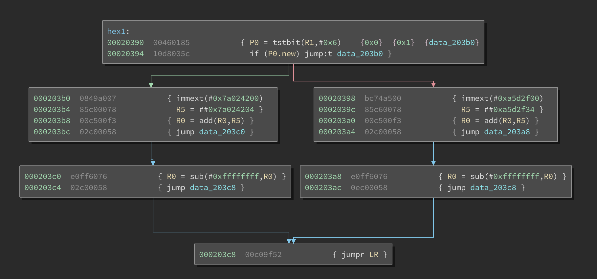
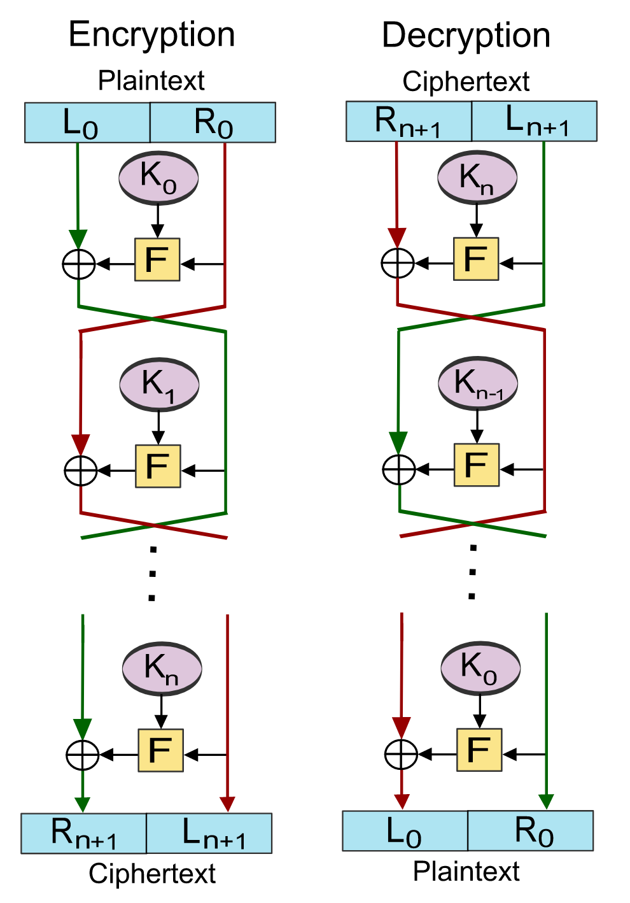

# Hexagon reversing challenge

A beginner's reverse engineering challenge in Qualcomm's [Hexagon](https://en.wikipedia.org/wiki/Qualcomm_Hexagon) architecture.

## Goals

Hexagon DSPs have unique properties:

1. **Scale**: CPU supports more than 2000 distinct instructions.

2. **Multi-threading**: with four execution slots, this CPU is inherently multi-threaded. Instructions are groups in packets, where each packet has up to four instructions that run in parallel.

3. **Data dependencies**: instructions in a given packet can reference data produced by other instructions in the same packet. This ".new" register semantics is unique to this variable length instruction CPU.

4. **Branch semantics**: a packet can have up to two branch instructions. There are many branch types: direct vs indirect, conditional vs unconditional and jump vs call. Only a single branch may be taken at the end of packet processing, subject to some ordering rules.

The goal of this challenge is to expose players to these unique CPU features.

## Operation

Eight input (STDIN) bytes are transformed then encrypted using a simple Feistel network.
The result is compared against the expected ciphertext. A message is displayed on success.

## Features

- Code redirection: return value on the stack is modified in `welcome()`.

- Masked strings: strings and target ciphertext are masked using a simple XOR.

- Two rounds of bijective transformations, followed by six rounds of a custom [Feistel network](https://en.wikipedia.org/wiki/Feistel_cipher). Key rounds are embedded in the code (`hex()` functions). Cipher function is a simple XOR.

## Hints and fun facts

- Constants in `check_flag()` spell `* google binja-hexagon *`.

- Sequence of numbers in `check_flag()` is the sequence of [Hexagonal numbers](https://en.wikipedia.org/wiki/Hexagonal_number) (1, 6, 15, 28, 45, 66, ...).

- Key round functions (`hex()`) are auto generated by `gen_hex_funcs.py`.

- Key rounds functions have a control flow graph that resembles a Hexagon (six nodes, six edges):



- A Feistel network has a dataflow graph that resembles a series of Hexagons:



## Reversing resources

- [QEMU v6](https://wiki.qemu.org/ChangeLog/6.0#Hexagon) can now emulate Qualcomm's Hexagon DSP units.

- gsmk's [hexagon](https://github.com/gsmk/hexagon) IDA plugin.

- Binary Ninja Hexagon [processor plugin](https://github.com/google/binja-hexagon).

## Challenge difficulty

There are many to solve this challenge:

1. Manually reversing the two bijective transformations (`hex1()`, `hex2()`) + manually emulating the other six to get the custom key rounds. Each function has four meaningful operations, so this is very doable.

2. Running `qemu-hexagon -d nochain,cpu,exec,in_asm` will spill out the Feistel key round values without any reversing. Then a single manual step to reverse the last transformations.

3. Using Binary Ninja API we can walk the [MLIL](https://docs.binary.ninja/dev/bnil-mlil.html) tree, analyze its data flow and build a z3 model of constraints. This model can evaluate / invert all `hex()` functions, and effectively solve this challenge. See [bn_solution.py](bn_solution.py) for details.

4. Brute forcing the 56bit space (8 printable characters) is possible (if you are desperate).

Together with the hints and the mild runtime redirection, this challenge should be easy for most teams.

Ideas on how to make it harder:

- Strip binary.

- Use more rounds and chain `hex()` functions together to make a manual only approach impractical.

- Use instructions not lifted by `binja-hexagon`, such as vector instructions.

- Use instructions not supported by `qemu`.

## How to check the solution

Build the latest qemu [repository](https://github.com/qemu/qemu):

```
$ git clone https://github.com/qemu/qemu
$ cd qemu ; mkdir build; cd build
$ ../configure --target-list=hexagon-linux-user
$ make
```

Echo the flag to the challenge binary. It should print 'Congratulations!':

```
$ echo IDigVLIW | ${qemu6-repo}/build/hexagon-linux-user/qemu-hexagon challenge
Hi!
Congratulations!
```

## How to re-flag

Update `FLAG` in `bn_solution.py`. Run `bn_solution challenge -r` to get the target ciphertext:

```
$ ./bn_solution.py  challenge -r
...
[IF_8 = False,
 arg2#0 = 6,
 R0#3 = 2830545833,
 temp211#1 = 0,
 R0_2#1 = 0,
 R0_1#4 = 3767547354,
 R0_1#5 = 3767547354,
 temp90#1 = 0,
 temp211#3 = 0,
 temp0_1#4 = 3767547354,
 arg1#0 = 1464421462,
 temp0#3 = 2830545833,
 IF_2 = False]
target:
.byte 0x28 ^ 0x97
.byte 0x29 ^ 0xbf
.byte 0x2a ^ 0x80
.byte 0x2b ^ 0x6d
.byte 0x2c ^ 0x3d
.byte 0x2d ^ 0xe
.byte 0x2e ^ 0x45

```

Copy the last bytes to `main.s`, and rebuild using `make -C .` The build process runs in Docker, and uses [debian-hexagon-cross](https://gitlab.com/qemu-project/qemu/container_registry/1759846) image that has `clang` with hexagon cross compilation support.

Check the solution using `bn_solution.py challenge -s`:

```
$ ./bn_solution.py  challenge -s
...
[IF_8 = False,
 arg2#0 = 6,
 R0#3 = 2830545833,
 temp211#1 = 0,
 R0_2#1 = 0,
 R0_1#4 = 3767547354,
 R0_1#5 = 3767547354,
 temp90#1 = 0,
 temp211#3 = 0,
 temp0_1#4 = 3767547354,
 arg1#0 = 1464421462,
 temp0#3 = 2830545833,
 IF_2 = False]
Solve completed successfully!
```

Note, `bn_solution.py` requires a working Binary Ninja license, and depends on Binary Ninja API.
