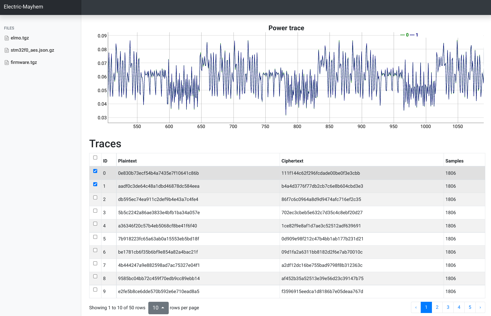

# Remote power analysis challenge - Classical Crypto edition

The server presents power traces of a secret firmware crypto operation. The goal is to recover the secret key.



## Design

The [firmware](challenge/firmware/main.c) runs under an enhanced ARM-M0 emulator called [ELMO](https://github.com/sca-research/ELMO). ELMO extends [thumbulator](https://github.com/dwelch67/thumbulator) with a model that estimates the power consumption of individual thumb instructions.

Access to sufficiently accurate power traces allows an attacker to mount [power analysis](https://en.wikipedia.org/wiki/Power_analysis) attacks, such as [Correlation Power Analysis](https://wiki.newae.com/Correlation_Power_Analysis) (CPA), or differential Power Analysis (DPA). See [healthcheck.py](healthcheck/healthcheck.py) for details.

## How to rebuild the challenge artifacts

```
$ git submodule update --init
$ make -C challenge clean all
```

## How to re-flag

Update `challenge/flag` and the global `FLAG` bytearray in `healthcheck/healthcheck.py`. Make sure `SPACE` contains the first two bytes of the new `FLAG`. Rebuild challenge artifacts using `make -C challenge`, and restart the challenge using `kctf chal start`.

## How to debug healthcheck.py

Disable the `healthcheck` in `challenge.yaml`, and re-deploy the server:

```
$ kctf chal start
```

Start port-forwarding to the challenge container:

```
$ kctf chal debug port-forward
[*] starting port-forward, ctrl+c to exit
Forwarding from 127.0.0.1:XXXXXX -> 1337

```

Run `healthcheck.py` and connect to the forwarded port:

```
$ cd healthcheck
$ python3 healthcheck.py --port XXXXXX --capture traces.json.gz
```

In addition, you can examine the logs using `kubectl logs [electric-mayhem-container] -c healthcheck`. A successful run should print the following:

```
Result: best guess for key index 0 is [0.9619903625357847, 'W']
Progress: best guess is [0.47799873358404277, 'A']
Progress: best guess is [0.5701319548208044, 'B']
Progress: best guess is [0.5701319548208044, 'B']
Progress: best guess is [0.5701319548208044, 'B']
Progress: best guess is [0.5701319548208044, 'B']
Progress: best guess is [0.5701319548208044, 'B']
Progress: best guess is [0.5701319548208044, 'B']
Progress: best guess is [0.5701319548208044, 'B']
Progress: best guess is [0.5701319548208044, 'B']
Progress: best guess is [0.5701319548208044, 'B']
Progress: best guess is [0.5701319548208044, 'B']
Progress: best guess is [0.5830737829585617, 'L']
Progress: best guess is [0.5830737829585617, 'L']
Progress: best guess is [0.5830737829585617, 'L']
Progress: best guess is [0.5830737829585617, 'L']
Progress: best guess is [0.5830737829585617, 'L']
Progress: best guess is [0.5830737829585617, 'L']
Progress: best guess is [0.5830737829585617, 'L']
Progress: best guess is [0.5830737829585617, 'L']
Progress: best guess is [0.5830737829585617, 'L']
Progress: best guess is [0.5830737829585617, 'L']
Progress: best guess is [0.5830737829585617, 'L']
Progress: best guess is [0.5830737829585617, 'L']
Progress: best guess is [0.5830737829585617, 'L']
Progress: best guess is [0.5830737829585617, 'L']
Progress: best guess is [0.5830737829585617, 'L']
Progress: best guess is [0.8864624504235293, '0']
Progress: best guess is [0.8864624504235293, '0']
Progress: best guess is [0.8864624504235293, '0']
Progress: best guess is [0.8864624504235293, '0']
Progress: best guess is [0.8864624504235293, '0']
Progress: best guess is [0.8864624504235293, '0']
Progress: best guess is [0.8864624504235293, '0']
Progress: best guess is [0.8864624504235293, '0']
Progress: best guess is [0.8864624504235293, '0']
Progress: best guess is [0.8864624504235293, '0']
Result: best guess for key index 1 is [0.8864624504235293, '0']
ok
```
