# Google CTF 2023 - RE: Flangton writeup

*Note: this writeup was created by a challenge tester during our internal test run*

After taking a look at the binary in a decompiler, we understand the code is moving an object around on a map according to some simple rules. (I later learned these "simple rules" are how [Langton's ant](https://en.wikipedia.org/wiki/Langton%27s_ant) moves.) When the object reaches a given end point, the simulation is stopped. The code then checks if the object ever passed through a specific point, which we will refer to as the "checkpoint". If so, we win. The map is encoded as a bitmap in the binary.

For starters, we can try to understand what the map looks like. Most points are initialized to zero, and some are set to one. The input flag toggles some points in the map, based on the bits of the provided flag. To better understand the map, we generate images of the map. The complete map is fairly large, so we generate images of the top lines, the bottom lines, the area around the checkpoint and the area around the end point. It turns out the map looks like some sort of electronic circuit.

Top left corner of the map:

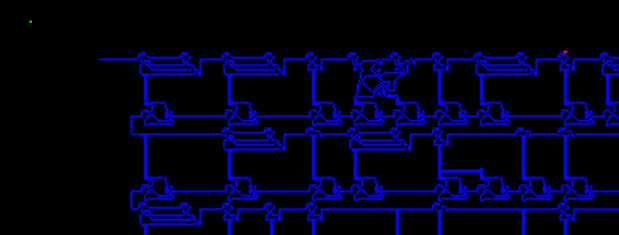

The green dot is the starting point. The blue dots are positions initialized to one in the bitmap. The red dot is a dot enabled or disabled, depending on the input flag.

Bottom left corner of the map:

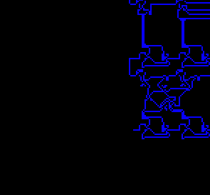

The checkpoint is contained in the lower left "fuse", which we will get to later.

It will probably be useful to create an emulator, so we can play with the problem more easily from Python. I reimplemented the algorithm from the binary in a Python script. Based on some test input flag, we can now draw the path the object takes.

This is the path of some (incorrect) test flag:

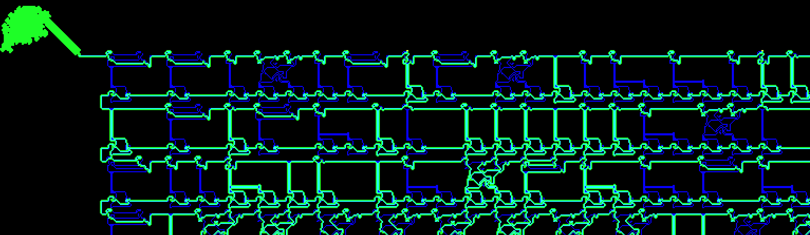

We observe some initial random movement, until it touches and "sticks" to the circuit, following it.

Generating a similar image for a different input flag shows the path taken is (slightly) different. In particular, different "fuses" light up.

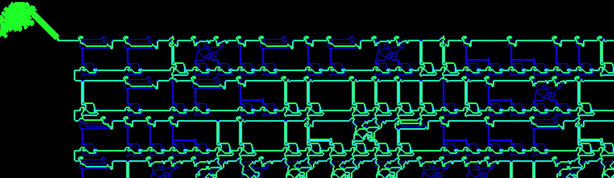

At this point we understand the path taken is influenced by the bits of the input flag. Toggling the right bits will make the path go through the checkpoint in the lower left fuse. Next we need to understand the logic that determines the followed path.

We recognize rows of what I will call "fuses" in the map. Not every position in a row contains a fuse. If a position in a row has a fuse, it can turn on, depending on the path taken.

Example of a turned on fuse:

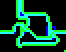

Example of a turned off fuse:

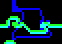

The fuses that turn on in a row depend on the layout of the circuit, which is fixed by the bitmap, and the state of the fuses in the previous row. Some of the fuse states of the first row are influenced by the input flag and via subsequent rows, will influence which fuses are turned on in the the last row. (The input flag sets some bits, which leads to an initial state of turned on fuses).

Different connections between rows of fuses are possible. Fuse states can be swapped, AND'ed, inverted, simply propagated, turned on or off (regardless of the previous row), or duplicated.

To be more precise, rows of fuses are actually separated by two layers which influence state propagation:

* **Connectors**: is the fuse on the next row actually connected to the previous row. If not, its value will be independent of the previous row.

    * Fuse with a connector to the previous row, i.e. the previous row will influence its state:

    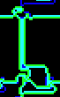

    * Fuse without a connector to the previous row, i.e. its state is independent of the previous row:

    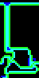

* **Gates**: logic that sets the state of the fuse in the next row based on one or more fuses in the previous row (e.g. swap, AND, invert, etc). (The names of these gates are invented by the writeup author.)

    * "Swapper" gate: fuse states are swapped with respect to the previous row

    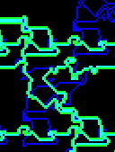

    * "Duplicator" gate: two fuse states are duplicated from the previous row

    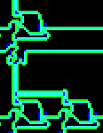

    * "AND" gate: both fuses in the previous row have to be turned on for the fuse to turn on

    

    * "Identity" gate: the fuse state is simply copied from the previous row.

    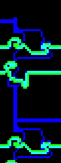 

    * "Inverter" gate: the fuse state is inverted from the previous row

    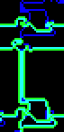

Now that we understand the logic behind the state propagation, we can write a higher level emulator, which operates at the granularity of the fuses and which emulates the propagation of fuse states based on the input flag. To achieve this we need first need to do some annoying map parsing to extract:

* The positions that contain a fuse
* The positions that have connectors
* The types of the different gates

To verify correctness, we can test a few input flags and compare the states of the fuses in the last row with those in our low level emulator.

The only thing left to do is to translate our high level emulator and the checkpoint condition to a Z3 problem, and let Z3 do the calculations. 

* We create a matrix of boolean Z3 variables, one for every fuse.
* We set the top row fuses to false, except for the fuses controlled by the bits of the input flag.
* We add an equation for every fuse state based on the fuse states of the previous row, the gates and the connectors.
* We add an equation that the leftmost gate of the bottom row should be turned on at the end (the "checkpoint").

After z3 solves these constraints, we extract the turned on fuses from the calculated model to obtain the distinct bits of the input flag.

The solver script can be found in [solve.py](solve.py), and the related image parsing artifacts can be found in the [artifacts](artifacts/) directory.

*Note: after solving the challenge, I learned it was inspired by [this paper](https://arxiv.org/pdf/1702.05547.pdf), in which the terminology (e.g. gate names) is slightly different.*