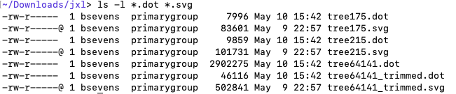
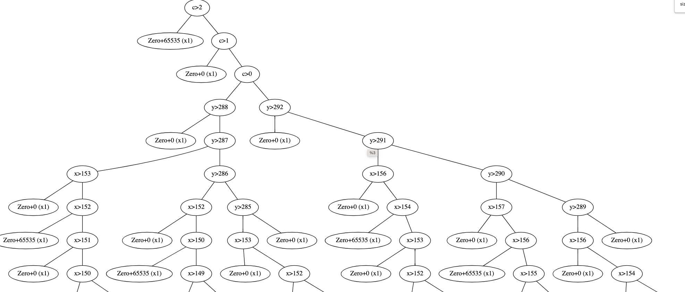
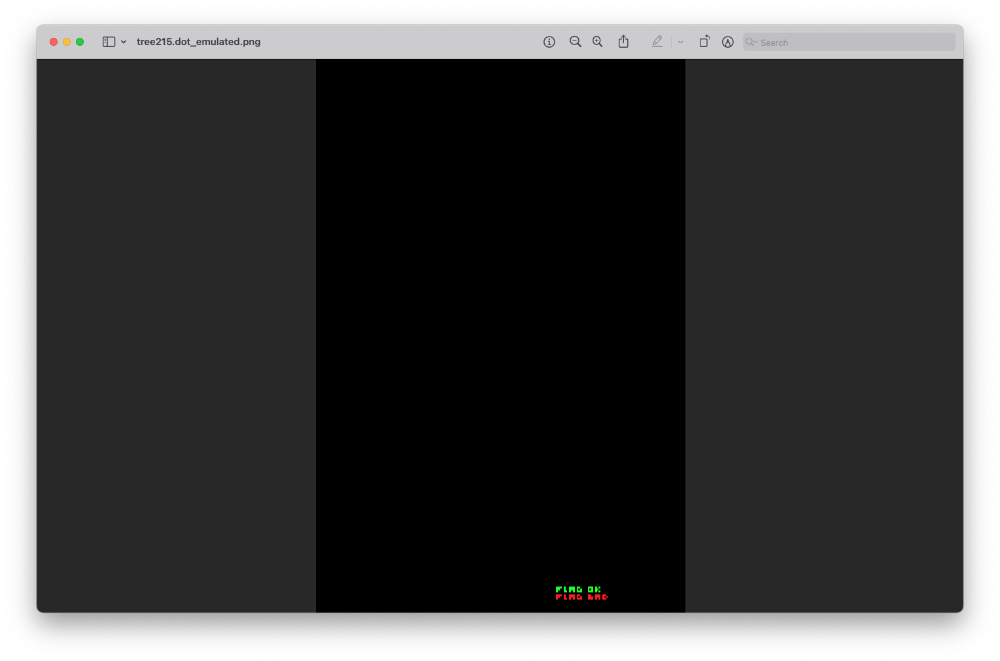
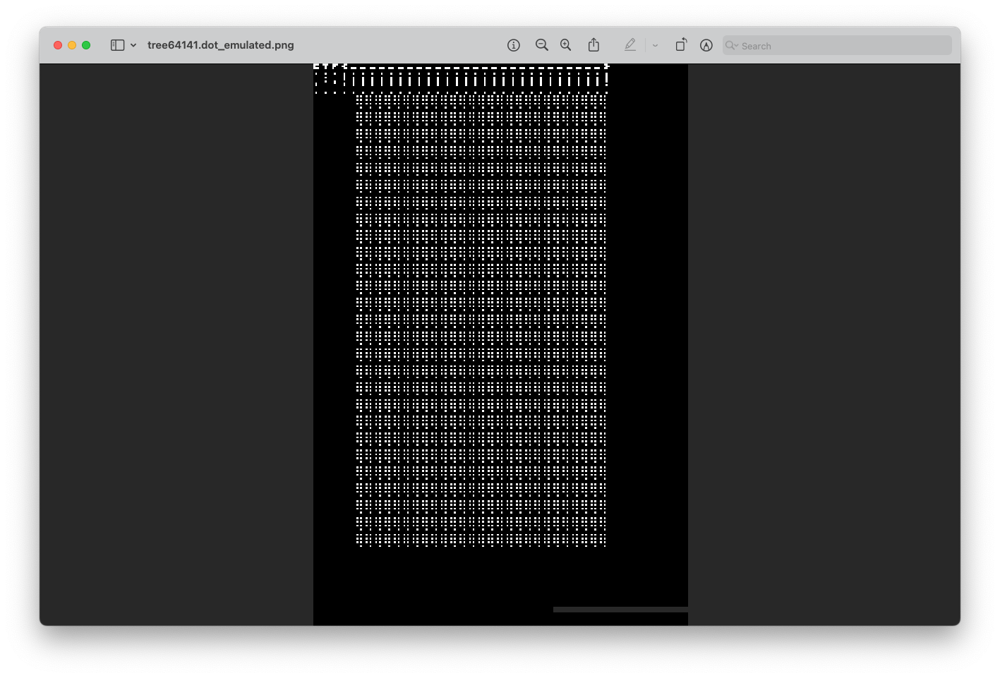
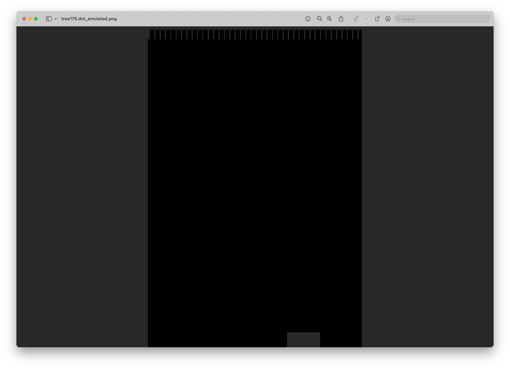
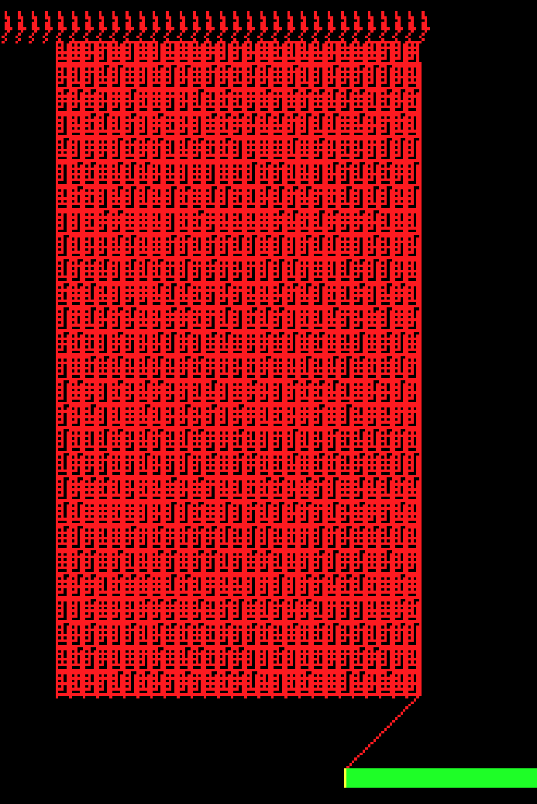
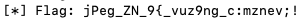
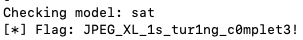
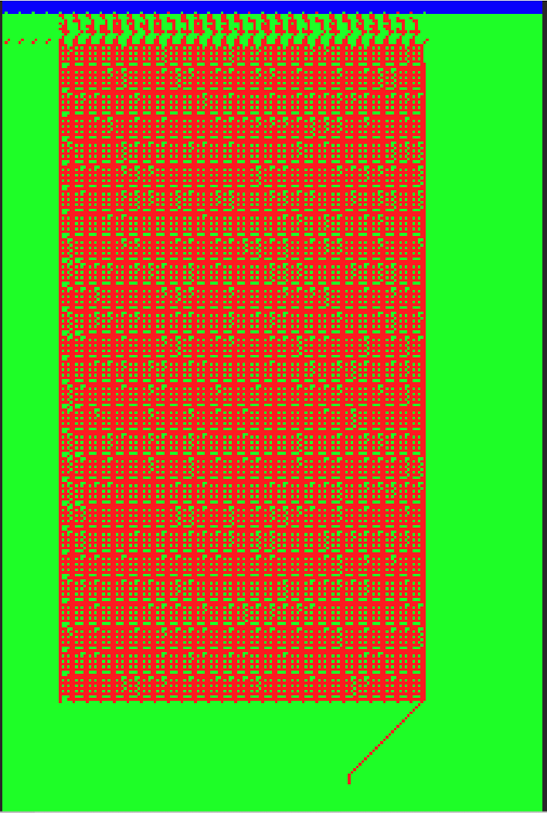

# Google CTF 2023 - RE: JXL writeup

*Note: this writeup was created by a challenge tester during our internal test run*

After some Googling on JXL, I landed on [this post](https://dbohdan.com/jpeg-xl), which explains the idea behind using JXL as a Turing complete machine.

By [increasing the debug level](https://github.com/libjxl/libjxl/blob/main/lib/jxl/base/status.h#L65) and recompiling `djxl`, we obtain more information in the debug output. The JXL file contains 3 trees. Every tree is parsed 4 times, likely once per "channel" (RGBA).

After some more `libjxl` code reading, I ended up discovering the [`PrintTree` function](https://github.com/libjxl/libjxl/blob/main/lib/jxl/modular/encoding/enc_debug_tree.h#L23). I then patched one of the functions on the code path of `djxl flag.jxl flag.png` to save the 3  to disk (with different filenames).

```cpp
diff --git a/lib/jxl/modular/encoding/encoding.cc b/lib/jxl/modular/encoding/encoding.cc
index 9d2c3e5c..b4026e93 100644
--- a/lib/jxl/modular/encoding/encoding.cc
+++ b/lib/jxl/modular/encoding/encoding.cc
@@ -13,6 +13,7 @@
 #include "lib/jxl/base/printf_macros.h"
 #include "lib/jxl/base/scope_guard.h"
 #include "lib/jxl/modular/encoding/context_predict.h"
+#include "lib/jxl/modular/encoding/enc_debug_tree.h"
 #include "lib/jxl/modular/options.h"
 
 namespace jxl {
@@ -131,6 +132,7 @@ Status DecodeModularChannelMAANS(BitReader *br, ANSSymbolReader *reader,
                                  const weighted::Header &wp_header,
                                  pixel_type chan, size_t group_id,
                                  Image *image) {
+  PrintTree(global_tree, std::string("tree") + std::to_string(global_tree.size()));
   Channel &channel = image->channel[chan];
```

This will output 3 distinct `.dot` files and also convert them to `.svg` files. One of the `.dot` files is fairly large and the svg conversion takes a very long time. By pressing Ctrl+C during `djxl` execution multiple times, I was able to interrupt the dot to svg conversion, but let `djxl` continue. This way I end up with 3 dot files and 2 svg files.

In order to still have an idea of what the big tree looks like, I trimmed the big dot file to only keep the first 1000 nodes and then redid the conversion manually, using the `dot` tool. In summary, I now have these files:



The generated tree images look something like this:



By looking at the trees and comparing the X and Y values in the trees with the initial PNG image, we get a first gist of what the 3 trees represent:
    
* **tree215** (which contains 215 nodes): "FLAG OK" written in green and below "FLAG BAD" written in red (I actually didn't know at this point the text was "FLAG OK", but we can guess it would be something along those lines since the tree tells us it is written in green and the "FLAG BAD" in red is visible in the PNG)
* **tree175** (which contains 175 nodes): only alpha channel predictors, masking out certain parts of the image
* **tree64141** (which contains 64141 nodes): probably the logic that masks out either the "FLAG OK" or "FLAG BAD" text

Time to write an emulator so we can emulate the trees to deepen our understanding. The emulator takes a .dot file and parses it into an (custom) internal representation. It then calculates every pixel from left to right, top to bottom by traversing the tree.

At this point, I found the [JXL art documentation](https://jxl-art.surma.technology/wtf.html), which helped tremendously when writing the emulator logic.

The emulator allows me to generate an image for every tree. In order to convey the values of the alpha channel, we display them in grey. White pixels obviously mean both red, green and blue channel are set.

Looking at these images, we can confirm our initial assumptions. "tree215" is indeed just the "FLAG OK" and "FLAG BAD" text:



"tree64141" contains the input flag at the top, sets a bunch of pixel values in the middle of the image, and importantly masks out the "FLAG OK" text:



"tree175" masks out everything except for top and bottom rows, likely to "clean up" the pixels in the middle of the image. Interestingly there is a "comb" form for the top rows.



Intuitively we now understand that have to focus on "tree64141". Based on the pixels of the top rows (which represent the input flag), some pixel values will propagate and end up masking out either the "FLAG OK" or "FLAG BAD" text.

All that's left to do is represent this problem in Z3 and have it solve the constraints?

The details of the Z3 solving are in the `solve.py` script, but the following is noteworthy:

* I add a condition that the pixel value in the red plane at position `(128,286)` needs to be different than 0. Indeed, the "FLAG OK" text is located there and the alpha plane at that location is calculated based on the green value at the location. Moreover, the green plane is equal to the red plane.
* I extensively use Z3's `If` function because some pixel values are conditional on other pixel values.

However, by converting this problem to Z3 I encountered an obstacle. My initial approach was to define a horizontal "cutoff" line. Pixels above the horizontal line had no constraints (they are to be calculated by Z3 and will give us the correct flag). Pixels under the cutoff line had constraints. I played with this cutoff line and tried different variations of it. 3 seemed the most logical since the `CTF{____....___}` characters are 3 pixels tall. However, if I put the cutoff line too high, the Z3 model was unsatisfiable. If I put the cutoff line lower, the model became satisfiable, but the top 3 lines (where the flag characters are) had unconstrained values.

Then it struck me that the predictor values in JXL trees are at most based on 1 pixel above ("north"). So if the challenge idea is to fill in the top 3 rows, the top 2 rows will have no influence on the lower lines. What was I missing?

To try to progress anyways, I decided to make an image of what data is "tainted" in the image, i.e. pixel values that depend on neighboring pixels and are not just constants. The tainted status of the R, G and B channel (all identical) are displayed in red, while the tainted status of the alpha channel is displayed in green.



This image confirms us that the alpha channel at the location of the "FLAG OK"/"FLAG BAD" text is influenced by the values in the R/G/B planes. But more importantly, the tainted values only start at row 5, so they can never by influenced by the top 3 rows.

When going back to check the other trees, the "comb" form in tree175 struck me. Maybe those were the pixels I had to change (and had to be unconstrained in Z3)?

I changed my Z3 conditions using two cutoff lines. Above the upper cutoff line, values were free. Between the upper and lower cutoff line, values in the teeth of the comb were free, while the others are constrained. Under the lower cutoff line, all values are constrained.

Running this model now calculates very specific values for the **teeth** of the comb. I guessed these pixels would represent the bits of the different characters of the flag, so I calculated the characters from the flag based on that. I obtained a string that starts to look like a flag (we can imaging reading "jPeg_XL_is_turing_complete!"), but some bits are definitely wrong:



After also adding constraints on the comb tooth that their value should be 0 or 1, I finally obtained the correct flag:



For fun, below is a representation of the Z3 calculated model. The meaning of the colors is:

* If a pixel is different from 0, it is displayed as red.
* If a pixel is equal to 0, it is displayed as green. 
* If a pixel is undefined by the model (meaning there value can be anything), it is displayed as blue.



The solver script can be found in [solve.py](solve.py), and the related artifacts can be found in the [artifacts](artifacts/) directory.