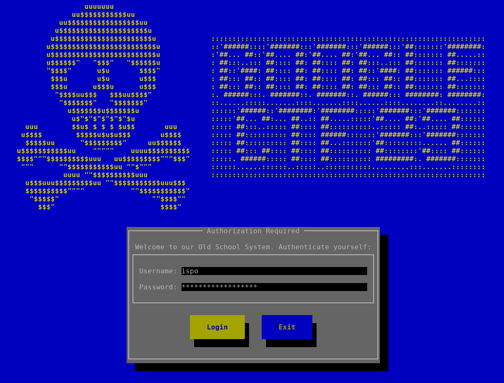
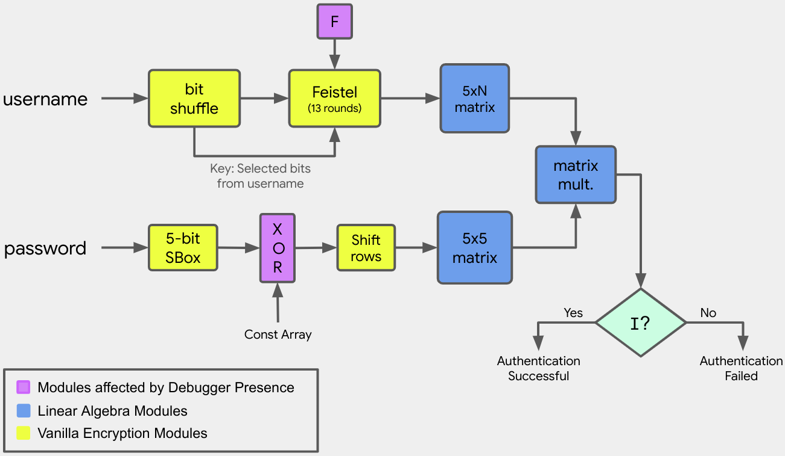
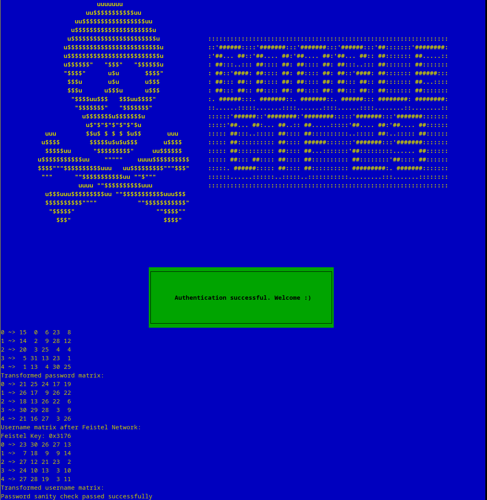

# GCTF'23 - Old School (RE)

## Challenge Description

*This challenge takes you back to the (good) old days of [crackmes.de](http://crackmes.cf/).
Your goal for this challenge is to write a "keygen", a program that generates valid passwords
for arbitrary given usernames. You are also given `flag_maker.py` that contains a list of usernames
that you have to find their corresponding passwords. Once you find all passwords, run the script and
you will get the flag.*


## Introduction

As the description states, this challenge takes you back to the old days of
[crackmes.de](http://crackmes.cf/), before the CTFs were made. 

Challenge is about writing a *KeyGen*. Instead of asking for a flag and verifying it, the program
asks for a valid username/password combination. To get the flag you need to find the passwords for
**50** randomly generated usernames and replace it in the flag_maker.py script which computes the
flag.
```python
pairs = [
    ('ispoleetmoreyeah1338', '{password}'),  # Correct password: D78UE-UJF6Y-VLYWY-X2F8J-STPA3
    # ...
    ('UlTVDrBlCmXmFBmwLLKX', '{password}')   # MGWH5-9B4T5-F3AL4-NRF74-A23V3
]

print('CTF{' + hashlib.sha1(b'|'.join(f'{u}:{p}'.encode('utf-8') for u, p in pairs)).hexdigest() + '}')
```

The challenge implements a mini GUI (from scratch) using
[ncurses](https://en.wikipedia.org/wiki/Ncurses) library. It also implements the button logic.
Below is an screenshot of the challenge:




## Keygen Algorithm

The diagram below shows the algorithm that validates the username and password combination:




### Username Processing

The username is processed into groups of **4** characters. The characters from each group are
converted into **28**-bit numbers (each character is a **7**-bit ASCII). **3** of these bits are
selected to become the key for the [Feistel Network](https://en.wikipedia.org/wiki/Feistel_cipher)
(see below) and the remaining **25**-bits are added as three **5**-bit numbers into a **5xN**
matrix.

The selection of the **3** (out of **28**) bits in each group is determined by a set of **32**
triplets that indicate the bit indices in this **28**-bit number:
```
{ 3, 10, 22}
{ 4, 12, 16}
{20, 13, 22}
{13, 22, 19}
{14, 13, 12}
{23,  7, 19}
{14, 20,  1}
{11,  7, 24}
{25, 11, 13}
{ 8, 9,   1}
{12, 7,  20}
{21, 19, 16}
{ 6, 23,  7}
{10, 18, 17}
{ 2, 11,  4}
{ 3, 10, 12}
{ 5, 26,  8}
{ 6, 15,  4}
{10,  0, 15}
{ 1, 14,  9}
{11,  7,  1}
{25,  1, 23}
{ 1,  9, 24}
{15, 23, 19}
{16, 22, 15}
{12,  4, 23}
{19, 24,  5}
{19,  8, 13}
{18,  1, 21}
{ 7,  4, 19}
{25,  8, 17}
{14,  6, 23}
```

For instance, the first triplet `{3, 10, 22}`, indicates that the **3rd**, **10th** and **22nd**
bits will be added to the Feistel Key. The selection of the next triplet is done using a
[Linear Congruential Generator](https://en.wikipedia.org/wiki/Linear_congruential_generator) (LCG).
Let `p` be a number initialized to **31337** (or any other random value). The value of `p`
(modulo **32**) determines the triplet to use. After we select the triplet, we append 3 bits to the
Feistel Key and we update `p`:

```c
for (k=1; k<1 + feistel_key & 7; ++k) {
    p = (8121 * p + 28411) % 134456;
}
```

Please note that the number of iterations is determined by the current values of the bits that we
selected. That is, the next triplet that we will select depends on the actual value of the username.

At the end of this iteration we will have a **5xN** matrix (padded with zeros to become a multiple
of **5**) and a (potentially long enough) Feistel key.

The next step is to encrypt every column of the matrix. Each column is converted into a **25**-bit
number and then encrypted using 13 rounds of a
[Feistel Network](https://en.wikipedia.org/wiki/Feistel_cipher). The round function is fairly
simple (and invertible).

```
F(r, k) = ROL(r, 3) ^ ~ROL(k, 1)
```

After the encryption, the resulting **25**-bit number is split into **5** **5**-bit numbers and
placed back to the same column, thus producing a **5xN** matrix of **5**-bit values.


### Password Processing

The processing of the password is simpler. First, there are some sanity checks to ensure that it is
in `XXXXX-YYYYY-ZZZZZ-WWWWW-KKKKK` serial number format (**5** groups of **5** characters each).
Each character can get one of the following **32** values:
```
23456789ABCDEFGHJKLMNPQRSTUVWXYZ
```

That is, each character contributes **5** bits to the matrix. That is, the password produces a
**5x5** matrix.

Then, the [SBox](https://en.wikipedia.org/wiki/S-box) from
[Shamesh](https://csrc.nist.gov/CSRC/media/Projects/Lightweight-Cryptography/documents/round-1/spec-doc/ShamashAndShamashash-spec.pdf)
algorithm is applied to this matrix, followed by a XOR with another constant matrix. Then, there is
the *ShiftRows* step from the [Rijndael](https://en.wikipedia.org/wiki/Advanced_Encryption_Standard)
algorithm that shifts each row by **0**, **1**, **2**, **3** and **4** positions respectively.


### Authentication

To verify that the username/password combination is correct, we multiply the resulting matrices from
the username (**5xN**) and the password (**5x5**). The result is a 5xN matrix. If **N** is **5**
and the matrix is the [Identity Matrix](https://en.wikipedia.org/wiki/Identity_matrix), then
authentication is successful. Please note that we do not really have to produce a new matrix,
all we have to do is to check that elements in the diagonal are **1** while every other element is
**0**.


### Anti-Debugging Protections

To make reversing harder, the program is shielded with some Anti-Debugging and Anti-Analysis
protections. All strings are obfuscated using a novel technique called 
*Compile Time String Obfuscation* using templates.

The second Anti-Debugging protection is more sneaky. First a handmade, inline assembly is used to
check if the debugger is present by making a ptrace system call:
```assembly
        .intel_syntax noprefix;
        push ebx               /* backup ebx */
        xor  ecx, ecx          
        movd eax, 0x22bc       /* obfuscate syscall to confuse decompiler */
        cwd                    
        movd ebx, 0x156        /* eax = 0x1a = ptrace */
        idiv bx                
        xor  ebx, ebx          /* PTRACE_TRACEME */
        xor  edx, edx          
        or   dl, 1             
        xor  esi, esi          
        int  0x80              /* do syscall */
        nop                    
        /* eax is 0 or -1 (-1 mean debugger precense) */
        neg eax                /* -1 ~> 0, 0 ~> 1 */
        movd %0, eax           /* store result */
        pop ebx
        .att_syntax noprefix;
        : "=r" (is_debugged)
```

Due to the way that this code is written, the decompiler fails to understand what it does.This code
is inserted into several places, deep into the [ncurses](https://en.wikipedia.org/wiki/Ncurses)
initialization and button logic.

If a debugger is detected, execution continues normally. The only thing that happens, is that some
values of the authentication algorithm are modified, thus generating incorrect results. More
specifically, we have **3** places in the code where we add the anti-debugging checks. Failure in
each check results in tampering a different value.

The first check is about modifying the initial value for the
[Linear Congruential Generator](https://en.wikipedia.org/wiki/Linear_congruential_generator):
```c
int lcg_seed = 31337;

CHECK_DEBUGGER;
if (is_debugged) {
    // Debugger detected. Modify LCG seed.
    lcg_seed += 7;
}
```

If a debugger is detected, authentication is performed using an initial seed value of **31344**
which is going to produce a different result (i.e., the correct username/password in the debugger
is not going to work outside of the debugger).

The second check flips a single bit from the “constant” XOR array:
```c
if (is_debugged) {
    // Debugger detected. Flip the wrong bit.
    for (int q=0; q<32; ++q) {
        xor_array[q] ^= 0x4;
    }
} else {
    for (int q=0; q<32; ++q) {
        xor_array[q] ^= 0x2;  // Flip the correct bit.
    }
}
```

If the debugger is detected, we flip the **3rd** bit from each value of the XOR array. Otherwise we
flip the **2nd** bit. In both cases the XOR array is modified, so the reverser cannot just copy the
global array and use it.

The last check is buried deep inside the button logic and modifies the LSBit of the triplets in
Feistel Key selection:
```c
    if (is_debugged) {
        // Debugger detected. Destroy the triplet order.
        for (int q=0; q<32; ++q) {
            feistel_key_triplets[q][1] ^= feistel_key_triplets[q][2];
            feistel_key_triplets[q][2] ^= feistel_key_triplets[q][1];
            feistel_key_triplets[q][1] ^= feistel_key_triplets[q][2];
        }
    } else {
        for (int q=0; q<32; ++q) {
            feistel_key_triplets[q][0] ^= feistel_key_triplets[q][1];
            feistel_key_triplets[q][1] ^= feistel_key_triplets[q][0];
            feistel_key_triplets[q][0] ^= feistel_key_triplets[q][1];
        }
    }
```


## Expected Solution

For this challenge you are given a set of random usernames and you are asked to find the
corresponding passwords. Given a username usr you have to work forward to generate the final matrix,
find its inverse and then work backwards to find the password:
```python
def crack_pwd_from_usr(usr: str) -> str:
  """Cracks the password from a given username."""  
  # Step 1: Apply forward algorithm to get username matrix.
  usrmat = usr_to_matrix_fwd(usr)

  # Step 2: Find the modular inverse of the username matrix.
  # If it does not exist, an exception will be raised.
  invmat = calc_matrix_mod_inv(usrmat, 32)
  
  # Step 3: Apply backward algorithm to get the password from inverse matrix.
  pwd = matrix_to_pwd_bwd(invmat)

  return pwd
```

First of all, we you will have to bypass the anti-debugging protections and fix the “constant”
tables:
```python
# Fix the constant arrays that are modified in Anti-Debugging checks.
for q in range(32):
    xor_array[q] ^= 0x2

    feistel_key_triplets[q][0], feistel_key_triplets[q][1] = (
      feistel_key_triplets[q][1], feistel_key_triplets[q][0])
```

Function `usr_to_matrix_fwd` applies the forward encryption to generate a **5x5** matrix from a
username:
```python
def usr_to_matrix_fwd(usr: str) -> List[List[int]]:
  """Transforms a username into a matrix (FORWARD ALGORITHM)."""
  assert len(usr) == 20

  p = 31337
  feistel_key = ''
  usrcols = 0
  keylen = 0
  usrmat = []

  for i in range(0, len(usr), 4):
    b = (((usr[i + 0] & 0x7F) << 21) |
         ((usr[i + 1] & 0x7F) << 14) |
         ((usr[i + 2] & 0x7F) <<  7) |
          (usr[i + 3] & 0x7F))
    b = f'{b:028b}'  
    t = feistel_key_triplets[p % 32]
       
    feistel_key += b[27 - t[0]] + b[27 - t[1]] + b[27 - t[2]]

    b = int(b, 2)
    for k in range(3):
      q = feistel_key_triplets[p % 32][k]
      b = ((b >> (q + 1)) << q) | (b & ((1 << q) - 1));            
   
    b = f'{b:025b}'

    for k in range(1 + (int(feistel_key, 2) & 7)):
      p = (8121 * p + 28411) % 134456  # LCG update.
      
    usrmat.append([~int(b[k:k + 5], 2) & 0x1F for k in range(0, 25, 5)][::-1])
  
    keylen += 3  
    usrcols += 1    

  feistel_key = int(feistel_key, 2)

  # Do the Feistel encryption.
  for i in range(usrcols):
    L = usrmat[0][i] | (usrmat[1][i] << 5) | ((usrmat[2][i] & 3) << 10)
    R = ((usrmat[2][i] & 0x1C) >> 2) | (usrmat[3][i] << 3) | (usrmat[4][i] << 8)
   
    for j in range(13):
      t = L ^ F(R, feistel_key, keylen)
      L = R & 0x7FFF;
      R = t & 0x7FFF;

    usrmat[0][i] = L & 0x1F
    usrmat[1][i] =  (L >>  5) & 0x1F
    usrmat[2][i] = ((L >> 10) & 0x3) | (R & 0x1C)
    usrmat[3][i] =  (R >>  5) & 0x1F
    usrmat[4][i] =  (R >> 10) & 0x1F

  return usrmat
```

Then function `calc_matrix_mod_inv` computes the modular inverse array:
```python
def calc_matrix_mod_inv(mat: List[List[int]], p: int) -> List[List[int]]:
  """Finds the inverse of matrix `mat modulo `p`."""  
  mat = numpy.matrix(mat)
  n = len(mat)
  adj = numpy.zeros(shape=(n, n))
  
  for i in range(0, n):
    for j in range(0, n):
      adj[i][j] = ((-1) ** (i + j) * int(round(numpy.linalg.det(minor(mat, j, i))))) % p
  
  inv = (mod_inv(int(round(numpy.linalg.det(mat))), p) * adj) % p
  # Convert array of floats to list of ints.
  return [[int(v) for v in row] for row in inv]
```

Finally `function matrix_to_pwd_bwd`, takes the inverse table and transforms back to a password:
```python
def matrix_to_pwd_bwd(usrmat: List[List[int]]) -> str:
  """Transforms a matrix to a password (BACKWARD ALGORITHM)."""
  usrmat = [[int(r) for r in row] for row in usrmat]  # Float to int.

  # Shift columns to the right.
  usrmat[1] = usrmat[1][4:] + usrmat[1][:4]
  usrmat[2] = usrmat[2][3:] + usrmat[2][:3]
  usrmat[3] = usrmat[3][2:] + usrmat[3][:2]
  usrmat[4] = usrmat[4][1:] + usrmat[4][:1]

  for i in range(5):
    for j in range(5):
      usrmat[i][j] ^= xor_array[i*5 + j]

  # Build inverse S-Box.
  inv_sbox = [-1]*32
  for i in range(32):
    inv_sbox[sbox[i]] = i

  for i in range(5):
    for j in range(5):
      usrmat[i][j] = inv_sbox[usrmat[i][j]]

  # Map matrix back to password form.
  pwd = [
    ''.join('23456789ABCDEFGHJKLMNPQRSTUVWXYZ'[usrmat[i][j]]
    for j in range(5))
    for i in range(5)
  ]

  return '-'.join(pwd)
```

Below is an example with debug logs enables:




Below are some valid username/password pairs:
```
    Ispoleetmoreyeah1338 <~> D78UE-UJF6Y-VLYWY-X2F8J-STPA3
    gdwAnDgwbRVnrJvEqzvs <~> 2UTQS-QFE2D-Z3P9K-6CFM9-TRRH5
    ZQdsfjHNgCpHYnOVcGvr <~> W8HTX-Q3T4K-KJKXJ-3YAUG-PYN8V
    PmJgHBtIpaWNEMKiDQYW <~> RT7LH-X4B4P-6KZZL-PEE3Z-9RS9F
    OAmhVkxiUjUQWcmCCrVj <~> HMXWT-68GY7-2VPUJ-EDFLX-A2FWA
    thrZhzSRBzJFPrxKmetr <~> ABD2P-7TG82-NUD2J-M3X4E-PYQPD
    SScTJRokTraQbzQpwDTR <~> J3793-WSSGE-S8GA7-YA6U3-5K9UW
    PObUeTjQTwEflLQtPOJM <~> M934Z-EKV2M-WUH7M-Y67LH-W3YDS
    LUDPGXGvuVFAYlMTTowZ <~> RAAY6-G6KXQ-M8JD5-YCQZ7-L5ZFR
    UlTVDrBlCmXmFBmwLLKX <~> MGWH5-9B4T5-F3AL4-NRF74-A23V3
```

Please note that not all usernames have a password. It is possible that the generated username
matrix is not invertible.


### Appendix
It is also possible to move backwards from password matrix to username. However, working backwards
in the username is more tricky. The Feistel Key is not part of the **5x5** matrix, so there will be
multiple usernames that map to the same password.
