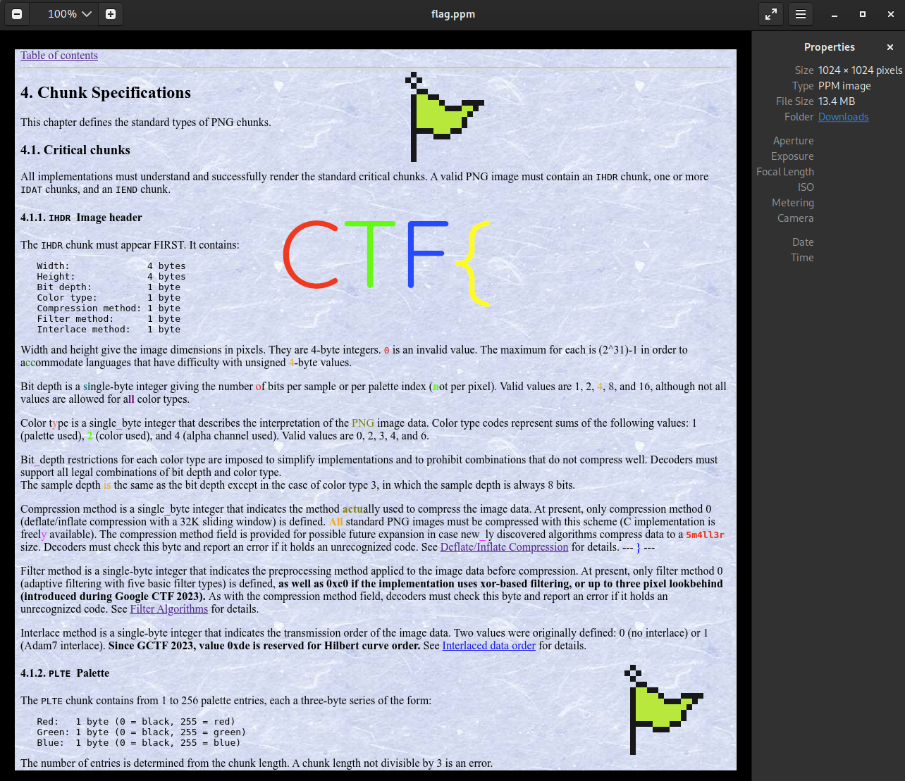

# Google CTF 2023 - RE: PNG2 writeup

*Note: this writeup was created by a challenge tester during our internal test run*

## Decoding

The encoding algorithm can be outlined as follows:

1. Pixels are shuffled.
2. For each row in the image, we choose one of 11 functions to apply to the pixels as an additional encoding/obfuscation step. The functions use pixel values from the same and previous row.
3. The resulting data is compressed with zlib.

### Decoding Rows

There are 11 encoding functions we need to revert. The first byte of each row in the png2 format denotes which function was used to encode it.

```python
def decode_0(*args):
    return args[1] ^ args[0]

def decode_1(*args):
    return args[2] ^ args[0]

def decode_2(*args):
    return args[3] ^ args[1] ^ args[2] ^ args[0]

def decode_3(*args):
    return args[0] + args[4]

def decode_4(*args):
    return args[0] + args[5]

def decode_5(*args):
    return args[4] ^ args[0]

def decode_6(*args):
    return args[0] ^ args[5]

def decode_7(*args):
    return args[5] ^ args[4] ^ args[1] ^ args[0]

def decode_8(*args):
    return args[0] + args[1]

def decode_9(*args):
    return args[0] + args[2]

def decode_10(*args):
    return args[0]

decode_fns = {
    0xe0: decode_0, 
    0xe1: decode_1,
    0xe2: decode_2,
    0xe3: decode_3,
    0xe4: decode_4,
    0xe5: decode_5,
    0xe6: decode_6,
    0xe7: decode_7,
    0x01: decode_8,
    0x02: decode_9,
    0x00: decode_10,
}
```

### Unshuffling Pixels

I didn't recognize the algorithm that shuffles the pixels, but it didn't matter. To save time, I copied the decompiled C pseudo code from Ghidra and translated it to Python. The result is ugly but it seems to work.

```python
def shuffle_seq(width):
    exponent = int(math.log2(width))
    lastIdx = (width * width) - 1
    idx = 0
    gotoLAB_00101e5d = 0;
    gotoLAB_00101e91 = 0;
    gotoLAB_00101e83 = 0;
    while True:
        uVar10 = idx & 0xffffffff;
        if (width != 1):
            bVar16 = 0;
            bVar11 = 1;
            bVar14 = 0;
            while True:
                while True:
                    if not gotoLAB_00101e83:
                        uVar3 = (uVar10 >> 1) & 1;
                        sVar2 = uVar3;
                        if (((uVar3 ^ uVar10) & 1) != 0):
                            break;
                        bVar15 = bVar16;
                        if (sVar2 == 0):
                            # goto LAB_00101e5d;
                            gotoLAB_00101e5d = 1;
                            break;
                        bVar14 = (bVar11 - 1) - bVar14;
                        bVar15 = (bVar11 - 1) - bVar16;
                    # LAB_00101e83:
                    gotoLAB_00101e83 = 0;
                    bVar16 = bVar14 + bVar11;
                    bVar11 = bVar11 * 2;
                    uVar10 = (uVar10 >> 2);
                    bVar14 = bVar15;
                    if (width <= bVar11):
                        # goto LAB_00101e91;
                        gotoLAB_00101e91 = 1;
                        break;
                if (gotoLAB_00101e91):
                    break;
                if not gotoLAB_00101e5d:
                    gotoLAB_00101e5d = 0;
                    bVar15 = bVar14 + bVar11;
                    bVar14 = bVar16;
                    if (sVar2 != 0):
                        # goto LAB_00101e83;
                        gotoLAB_00101e83 = 1;
                        continue;
                # LAB_00101e5d:
                gotoLAB_00101e5d = 0;
                bVar16 = bVar14;
                bVar11 = bVar11 * 2;
                uVar10 = (uVar10 >> 2);
                bVar14 = bVar15;
                if not bVar11 < width:
                    break
            # LAB_00101e91:
            gotoLAB_00101e91 = 0;
            puVar7 = (bVar15 << (exponent & 0x1f) | bVar16);
        yield puVar7
        isNotEnd = lastIdx != idx;
        idx = idx + 1;
        if not isNotEnd:
            break
```

### Full Code

Finally, I pieced everything together to restore the flag PPM file. Note that I missed that the image's dimensions are encoded in the png2 file format; instead I solved `x * (3x + 1) = raw_image_bytes_len` for x, which is the image's width and height.

```python
import math
import sys
import zlib

def decode_0(*args):
    return args[1] ^ args[0]

def decode_1(*args):
    return args[2] ^ args[0]

def decode_2(*args):
    return args[3] ^ args[1] ^ args[2] ^ args[0]

def decode_3(*args):
    return args[0] + args[4]

def decode_4(*args):
    return args[0] + args[5]

def decode_5(*args):
    return args[4] ^ args[0]

def decode_6(*args):
    return args[0] ^ args[5]

def decode_7(*args):
    return args[5] ^ args[4] ^ args[1] ^ args[0]

def decode_8(*args):
    return args[0] + args[1]

def decode_9(*args):
    return args[0] + args[2]

def decode_10(*args):
    return args[0]

decode_fns = {
    0xe0: decode_0, 
    0xe1: decode_1,
    0xe2: decode_2,
    0xe3: decode_3,
    0xe4: decode_4,
    0xe5: decode_5,
    0xe6: decode_6,
    0xe7: decode_7,
    0x01: decode_8,
    0x02: decode_9,
    0x00: decode_10,
}

def find_image_width(target_size):
    for i in range(target_size):
        size = i*(i*3+1)
        if size == target_size:
            return i
    assert False

def get_encoded_pixel(data, width, x, y):
    row_size = 1 + width*3

    b = data[1 + x*3 + row_size*y]
    g = data[1 + x*3 + 1 + row_size*y]
    r = data[1 + x*3 + 2 + row_size*y]
    return (b, g, r)

def get_decoded_pixel(image, width, x, y):
    return image[y*width+x]

def shuffle_seq(width):
    exponent = int(math.log2(width))
    lastIdx = (width * width) - 1
    idx = 0
    gotoLAB_00101e5d = 0;
    gotoLAB_00101e91 = 0;
    gotoLAB_00101e83 = 0;
    while True:
        uVar10 = idx & 0xffffffff;
        if (width != 1):
            bVar16 = 0;
            bVar11 = 1;
            bVar14 = 0;
            while True:
                while True:
                    if not gotoLAB_00101e83:
                        uVar3 = (uVar10 >> 1) & 1;
                        sVar2 = uVar3;
                        if (((uVar3 ^ uVar10) & 1) != 0):
                            break;
                        bVar15 = bVar16;
                        if (sVar2 == 0):
                            # goto LAB_00101e5d;
                            gotoLAB_00101e5d = 1;
                            break;
                        bVar14 = (bVar11 - 1) - bVar14;
                        bVar15 = (bVar11 - 1) - bVar16;
                    # LAB_00101e83:
                    gotoLAB_00101e83 = 0;
                    bVar16 = bVar14 + bVar11;
                    bVar11 = bVar11 * 2;
                    uVar10 = (uVar10 >> 2);
                    bVar14 = bVar15;
                    if (width <= bVar11):
                        # goto LAB_00101e91;
                        gotoLAB_00101e91 = 1;
                        break;
                if (gotoLAB_00101e91):
                    break;
                if not gotoLAB_00101e5d:
                    gotoLAB_00101e5d = 0;
                    bVar15 = bVar14 + bVar11;
                    bVar14 = bVar16;
                    if (sVar2 != 0):
                        # goto LAB_00101e83;
                        gotoLAB_00101e83 = 1;
                        continue;
                # LAB_00101e5d:
                gotoLAB_00101e5d = 0;
                bVar16 = bVar14;
                bVar11 = bVar11 * 2;
                uVar10 = (uVar10 >> 2);
                bVar14 = bVar15;
                if not bVar11 < width:
                    break
            # LAB_00101e91:
            gotoLAB_00101e91 = 0;
            puVar7 = (bVar15 << (exponent & 0x1f) | bVar16);
        yield puVar7
        isNotEnd = lastIdx != idx;
        idx = idx + 1;
        if not isNotEnd:
            break

def unshuffle_pixels(image, width):
    new_image = [None] * (width*width)
    j = 0
    for i in shuffle_seq(width):
        new_image[i] = image[j]
        j += 1
    return new_image

def write_image(image, width):
    with open(sys.argv[2], 'w') as f:
        f.write("P3\n")
        f.write(f'{width} {width}\n')
        f.write("255\n")
        for px in image:
            f.write(' '.join([str(c) for c in px]) + '\n')

ZERO_PX = (0, 0, 0)

with open(sys.argv[1], 'rb') as f:
    data = f.read()

    # strip magic bytes, headers, etc.
    data = data[8:]
    data = data[25:]
    data = data[:-12]
    data = data[4:]
    data = data[:-4]
    data = data[4:]

    data = zlib.decompress(data)
    width = find_image_width(len(data))
    print(f"Image width: {width}")
    row_size = 1 + width*3
    image = [None]*(width*width)
    for y in range(0, width): # height == width
        decoder = data[row_size*y]
        for x in range(0, width):
            prev_prev_px = ZERO_PX
            prev_px = ZERO_PX
            prev_row_px = ZERO_PX
            prev_prev_prev_px = ZERO_PX
            prev_row_prev_px = ZERO_PX

            if y > 0:
                prev_row_pixel = get_decoded_pixel(image, width, x, y - 1)
                prev_row_px = get_decoded_pixel(image, width, x, y - 1)
            
            if x > 0:
                prev_px = get_decoded_pixel(image, width, x - 1, y)
                if y > 0:
                    prev_row_prev_px = get_decoded_pixel(image, width, x - 1, y - 1)
            
            if x > 1:
                prev_prev_px = get_decoded_pixel(image, width, x - 2, y)

            if x > 2:
                prev_prev_prev_px = get_decoded_pixel(image, width, x - 3, y)

            current_px = get_encoded_pixel(data, width, x, y)
            decoded_px = [0, 0, 0]
            for c in range(3):
                decoded_color = decode_fns[decoder](current_px[c], 
                                                       prev_px[c], 
                                                       prev_row_px[c], 
                                                       prev_row_prev_px[c], 
                                                       prev_prev_px[c], 
                                                       prev_prev_prev_px[c]) & 0xFF
                decoded_px[c] = decoded_color
            image[y*width+x] = tuple(decoded_px)

    write_image(unshuffle_pixels(image, width), width)
```

Usage:

```
$ python3 png2decode.py flag.png2 flag.ppm
```

## Problems Encountered

The png2 binary in attachments is compiled such that it does not encode PPMs with a width larger than 128 px. I wasn't sure if this was intentional (author's note: it was intentional). I discovered this behavior after feeding the binary a deterministically generated PPM of size 1024x1024 that I created for debugging my png2 decoder. 

## Flag Screenshot


