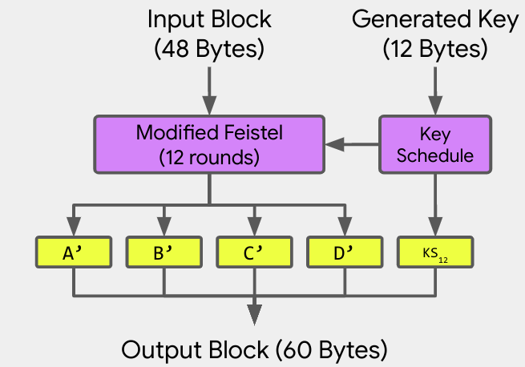
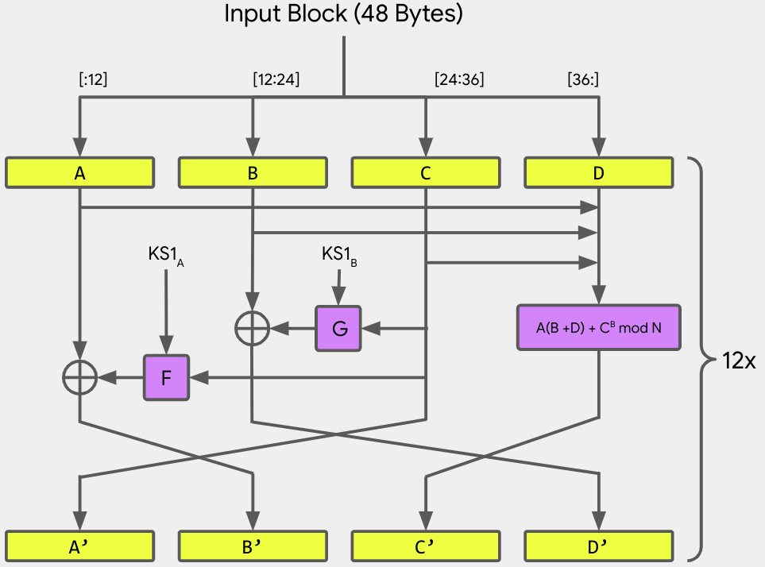
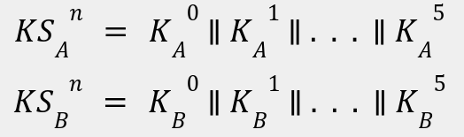
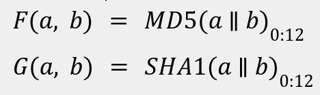

# RE Challenge: 🦀`Rusty School🦀`

_My school asked me to create a new encryption algorithm. ...But I haven't done any crypto for years. My skills are a little bit rusty... Nevertheless,  I managed to write this cool encryption tool. It works (well that's at least what I'm claiming) and it seems to be impossible to decrypt the ciphertext :evil. Or it's not???_
___

## Introduction

This challenge aims to “school” players the Rust internals. The goal for this challenge is to first
understand how the various Rust concepts are translated into assembly code, then reverse engineer
the encryption algorithm, invert it and finally to write a decryption tool to decrypt the
`flag.txt.encrypted` file.

Binary takes a single command line argument which corresponds to the path of an arbitrary
-plaintext- file to encrypt  (e.g., `foo.txt`). Binary encrypts the file using an -invertible-
custom made algorithm and produces a new file with the `.encrypted` file extension
(e.g., `foo.txt.encrypted`).
___

## Encryption Algorithm

The source code for the challenge can be found in the repo.
The input file is loaded and is split into **48-byte** blocks (the last block is appended with NULL
bytes if needed). Each block is encrypted individually using a **12-byte** randomly generated key.
The key is mutated during the block encryption and final key mutation is appended to the ciphertext.
That is, the ciphertext is **60-bytes**. Below is a high level overview of the block encryption:



The **48-byte** block is further split into **4** **12-byte** chunks and it is being inserted into a
modified, **12** round, **4** route [Feistel Network](https://en.wikipedia.org/wiki/Feistel_cipher).
Below is the layout of the Feistel Network:



As you can see, the first **3** routes (`A`, `B` and `C`) are actually a direct extension of the of
Feistel using **2** round functions **F** and **G**. The last route (`D`) is a modular math
operation between all **4** routes: `A*(B + D) + C^B mod N`, where `N` is a constant, prime number
(in our case `0xFFC7B98B3EDDBD9EA6929283`). It’s important that `D < N` so we can recover `D`. 
That’s why we use a large prime (that starts with `0xFF`).
___

## Key Schedule

At the beginning of each block encryption, a random, **12-byte** key `K_init` is generated.
The round functions **F** and **G** take as input two keys `KS_A^1` and `KS_B^1` which are derived
from the original key `K_init`; this is a concept borrowed from
[Key Schedule in DES](https://en.wikipedia.org/wiki/Data_Encryption_Standard#Key_schedule).
At end of the round, a new set of keys `KS_A^2` and `KS_B^2` is derived from the current round keys.
Once the [Feistel Network](https://en.wikipedia.org/wiki/Feistel_cipher) (after **12** rounds)
is complete, the final key `KS_B^12` is appended at the output block. In order to decrypt a block,
we need to be able to recover `K_init` from `KS_B^12` (which is part of the ciphertext).
That is, all key schedule transformations need to be invertible.

To derive a new set of round keys from the previous round, we use
[Galois Fields](https://en.wikipedia.org/wiki/Finite_field). More specifically, we use `GF(2^16)`
and the following [irreducible polynomial](https://en.wikipedia.org/wiki/Irreducible_polynomial)
to perform all operations:
```
  x^16 + x^5 + x^3 + x + 1.
```

All operations are on `16-bit` numbers, but the random key is longer. `K_r` be a **12-byte**
round key. We split it into **6** **16-bit** subkeys `K_r^i`, where `i in [0, 6)`. 
Initially `K_r = K_init`mv. To compute the round keys for the **n-th** round,
we set `K_r = KS_A^(n-1)`. Then we compute the **6** subkeys individually using the following
equations:


The next round keys well be the concatenation of all subkeys:



Please recall that all operations (addition and multiplication) are on `GF(2^16)`
and the multiplication is modulo our irreducible polynomial.
___

## Round Functions F and G

The round functions **F** and **G** do have to be invertible as we can run the
[Feistel Network](https://en.wikipedia.org/wiki/Feistel_cipher) backwards without inverting them.
To keep implementation simple, we define **F** and **G** as follows:



That is, the round function **F** concatenates its **2** parameters and computes the **MD5**
digest of the result. The function output is the **12** LSBytes. Round function **G** is identical,
but the **SHA1** digest algorithm is used instead.
___

## Block Cipher Mode of Operation

Our algorithm **does not** use any
[block cipher mode of operation](https://en.wikipedia.org/wiki/Block_cipher_mode_of_operation).
That is, each block is encrypted individually, so it is essentially an _Electronic Codebook_ (ECB). However, we do not have to worry about generating two identical ciphertext blocks from the same
plaintext block, because each block is encrypted using a unique random **12-byte** key.
___

## Anti-Debugging Protections

None. In fact the binary will be not-stripped to make it easier to understand rust structures.
___

## Expected Solution

The expected way to solve this challenge, is to first recover the encryption key from the `KS_B^12`.
To do this you have to solve the aforementioned non-linear equation system in Galois Fields.
The problem is that there may be more than one solution (or none). We do this in sage math:

```python
def gfcrack(coeff, rkey_ty):
  """Solves a non-linear equation system in GF(2^16) to recover the round keys.

  Given a set of 6 subkeys from round i, rustyschool computes the round keys KSi_A
  and KSi_B as follows:

      let k_a: Vec<u16> = (0..6).map(|i|
          gfmul(subkeys[i], subkeys[(i + 1) % 6]) ^ subkeys[(i + 4) % 6]
      ).collect();
      let k_b: Vec<u16> = (0..6).map(|i|
          gfmul(subkeys[(i + 2) % 6], subkeys[(i + 3) % 6]) ^ subkeys[(i + 5) % 6]
      ).collect();
  
  Since all operations are in GF(2^16) by irreducible polynomial x^16 + x^5 + x^3 + x + 1,
  to recover the subkeys from the round keys, we have to solve a nonlinear equation
  system (we have a similar system for KSi_B):

      sk0 * sk1 + sk4 = KSi_A_0
      sk1 * sk2 + sk5 = KSi_A_1
      sk2 * sk3 + sk0 = KSi_A_2
      sk3 * sk4 + sk1 = KSi_A_3
      sk4 * sk5 + sk2 = KSi_A_4
      sk5 * sk0 + sk3 = KSi_A_5

  Please note that it may be possible to have >1 one solutions (or no solutions at all).

  Args:
    coeff: The list of equation coefficients (i.e., the round key).
    rkey_ty: The round key type ('A' or 'B').

  Yields:
    A list with the 6 round keys (if there is a solution).
  """
  K.<y> = GF(2)[]
  subkeys.<x> = GF(2^16, name='x', modulus=y^16 + y^5 + y^3 + y + 1)
  R.<sk0, sk1, sk2, sk3, sk4, sk5> = AffineSpace(6, subkeys)

  def gen_ideal(coeff):
    if rkey_ty == 'A':
      return ideal(
          sk0*sk1 + sk4 - coeff[0],
          sk1*sk2 + sk5 - coeff[1],
          sk2*sk3 + sk0 - coeff[2],
          sk3*sk4 + sk1 - coeff[3],
          sk4*sk5 + sk2 - coeff[4],
          sk5*sk0 + sk3 - coeff[5])
    elif rkey_ty == 'B':
      return ideal(
          sk2*sk3 + sk5 - coeff[0],
          sk3*sk4 + sk0 - coeff[1],
          sk4*sk5 + sk1 - coeff[2],
          sk5*sk0 + sk2 - coeff[3],
          sk0*sk1 + sk3 - coeff[4],
          sk1*sk2 + sk4 - coeff[5])
    else:
      raise Exception(f'Unknown rkey_ty: {rkey_ty}')
  
  # NOTE: fetch_int is deprecated. Use new from_integer.
  I = gen_ideal([subkeys.fetch_int(c) for c in coeff])
  S = R.subscheme(I)
  for P in S.rational_points():
    # # Substitute variables to ensure they're all zeros.
    # print(I.subs(sk0=P[0], sk1=P[1], sk2=P[2], sk3=P[3], sk4=P[4], sk5=P[5]))

    # NOTE: integer_representation is deprecated. Use new to_integer.
    yield [p.integer_representation() for p in P]
```

You have to repeat this process **12** times, for every round in the Feistel Network. Then,
once you have the original key you can run the network forward to find all round keys.
Since there can be more than one solution at each round, we have to fork and try all possible paths.
At the end, we will have a set of possible keys (usually between **5** to **20**).
Since we do not know which one is the correct, we try all of them and we check which key yields to
an ASCII printable plaintext (yes, we know that since the file we want to decrypt is a `.txt` file).

Once we do this, we move on to the next block, until we decrypt the whole file.

For more details, please refer to the [rustyschool_crack.sage](./rustyschool_crack.sage) script.
___
