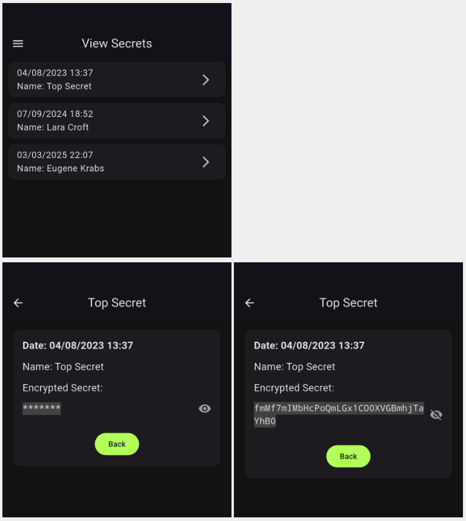

# Google CTF 2025 - Fluffy (RE)

## Challenge Description

*I don’t trust anyone anymore... I have written my own App to protect my secrets.*
*I also used my own encryption algorithm, because I believe security by obscurity truly works.*
*But, I didn’t have time to implement the decryption functionality yet.*
*My friend (who lives in Switzerland) told me to not bother myself with it as he was able to recover my secrets in less than 20 minutes...*
*How is this even possible? I’m sure he does not have hundreds of cores at home...*
___

## Solution

This is a flutter reverse engineering challenge. Players get an App (written in flutter) that can
encrypt messages using a **PIN** and a **random token**. The decryption functionality is missing.
The goal is to recover the **3** secrets which contain the flag. The actual encryption algorithm
is rather simple. The hard parts are to locate where the algorithm is in the `libapp.so` and then
optimize the bruteforce. Let’s start with the app:


Now let’s see the secrets. We can click on any of them and then press the eye icon to see their
contents:



Please note that **the timestamp on the first secret also displays the seconds**. That’s actually a
hint to crack the ciphertext quicker.

Then we move on to the token generator. This page generates a random token which can be used in the
encryption algorithm:


Then we go to the encryption page. We have **4** fields: `name`, `token`, `PIN` and `secret`.
We need to fill all of them, otherwise we get a warning. The `PIN` must be **nonzero** and have
exactly **4** digits. If everything goes well we will be redirected to the “View Secrets” page and
our encrypted secret will be there. We can click on the eye icon it to see it:


Finally we have the page to decrypt a secret however, it is under construction:


The goal is to crack the **3** ciphertexts (which encrypt the flag):
```
fmMf7mIMbHcPoQmLGx1CO0XVGBmhjTaYhB0
5O6WRgCajs3QSTyohnu2hldds18mjkx
fgv99dOvazsvEESh7DPKbb3k0I3RW
```
___

### Encryption Algorithm

Let’s start first with the token generation (code is written in Dart):
```dart
// Generates a random token based on the current timestamp (in seconds).
// This means we only have 86400 possible token per day.
//
// The token is computed as follows:
//    Base62(SHA1('gctf25_' + current_timestamp.seconds)[:8])
String generateToken() {
  final String timestamp = (DateTime.now().millisecondsSinceEpoch ~/ 1000).toString();
  final List<int> seed = utf8.encode("gctf25_$timestamp");
  final crypto.Digest digest = crypto.sha1.convert(seed);

  // Encode the first 8 raw bytes of the digest using Base62.
  return Base62Encoder.encode(Uint8List.fromList(digest.bytes).sublist(0, 8));
}
```

The result is converted into a custom `Base62` string (just like `Base64` but without
the `+` and the `/`):
```dart
// A custom Base62 encoder.
class Base62Encoder {
  static const String _alphabet = '0123456789ABCDEFGHIJKLMNOPQRSTUVWXYZabcdefghijklmnopqrstuvwxyz';
  static const int _base = 62;

  // Encodes a list of bytes into a Base62 string.
  static String encode(Uint8List bytes) {
    if (bytes.isEmpty) {
      return "";
    }

    // Convert bytes to a BigInt.
    BigInt number = BigInt.from(0);
    for (int i = 0; i < bytes.length; i++) {
      number = (number << 8) + BigInt.from(bytes[i]);
    }

    if (number == BigInt.zero) {
      return '?';  // Nah, that's not going to happen.
    }

    final sb = StringBuffer();
    while (number > BigInt.zero) {
      final remainder = number % BigInt.from(_base);
      sb.write(_alphabet[remainder.toInt()]);
      number = number ~/ BigInt.from(_base);
    }

    // The result is reversed, so we need to return the reversed string.
    return sb.toString().split('').reversed.join('');
  }
```

Then we have the encryption algorithm which is also fairly simple:

```dart
// My custom encryption class for encrypting secrets.
class CustomEncrypt {
  final String token;
  final int pin;

  CustomEncrypt(this.token, this.pin);

  String encrypt(String secret) {
      List<int> dynToken = Base62Encoder.decode(token);
      List<int> encrSecret = secret.codeUnits.toList();

      for (int i = 0; i < pin; i++) {
        final List<int> nextEncrSecret = [];
        for (int j = 0; j < encrSecret.length; j++) {
          nextEncrSecret.add(rol8((encrSecret[j] + dynToken[j % dynToken.length]) % 256, j % 8));
        }
        encrSecret = nextEncrSecret;

        encrSecret = [encrSecret.last, ...encrSecret.sublist(0, encrSecret.length - 1)];
        dynToken = [...dynToken.sublist(1), dynToken.first];
        dynToken = dynToken.map((d) => ror8(d, (pin ^ ((i & 3) + 1) % 8))).toList();
      }

      return Base62Encoder.encode(Uint8List.fromList(encrSecret));
    }
}
```

The interesting part is the use of the `PIN`. We have `PIN` rounds (i.e., the bigger the `PIN`,
the more time it takes to encrypt). On each round we modify all bytes from the secret by adding
bytes from the `token` to it. At the end, the elements of both the `token` and the secret rotate.
The bits inside the `token` also rotate depending on the `PIN` value. The rotation is done very
carefully to allow a quick bruteforce solution. Please see the code below for more details.

The decryption follows the inverse operation. However, we first have to find the last instance of
the `token` (as it changes on every round) and work backwards from it.
Below is the decryption (and the encryption) in Python:

```python
def encrypt(pin, token, secret):
    """Encrypt a `secret` using a `pin` and a random `token`."""
    assert pin > 0 and pin <= 9999  # Sanity check.

    dyn_token   = list(base62_decode(token))
    encr_secret = list(secret)

    # Iterate `pin` times. That's tricky. This is actually an exponential algorithm.
    for i in range(pin):
        encr_secret = [
            rol8((s + dyn_token[j % len(dyn_token)]) % 256, j % 8)
            for j, s in enumerate(encr_secret)
        ]

        # Now rotate the secret and the token arrays by one position (left and right).
        encr_secret = [encr_secret[-1]] + encr_secret[:-1] # To the right.
        dyn_token = dyn_token[1:] + [dyn_token[0]]         # To the left.

        # Now rotate each element. By default the token is 8 bytes so after 8 rounds, the
        # token bytes go back to their original position.
        #
        # We need the `dyn_token` to be repeated after K rounds, to enable our optimization.
        #
        # However, the bits inside each byte also rotate. So after 8 rounds, the bits in
        # each byte need to rotate exactly 8*N times if we want to get back the original
        # `dyn_token`.
        #
        # Now let's complicate things a bit: We set `dyn_token` to repeat exactly every 16
        # rounds. To do this, the bits in every byte need to rotate 20 times exactly after
        # 8 rounds, so after 16 rounds the will be rotated 40 = 5*8 times and they will be
        # back to their original position.
        #
        # So we need formula -which is not so obvious- that has the property that the summary
        # of all 16 numbers it produces, will add to a multiple of 8, but the summary of the
        # first 8 number will not add to a multiple of 8 (so we will not repeat after 8 rounds).
        #
        # After some trial and error, I came up with this formula: (pin ^ ((i & 3) + 1)) % 8.
        # Let's see how it behaves:
        #
        #   for pin_mod in range(8):
        #       rot = [(pin_mod ^ ((i & 3) + 1)) % 8 for i in range(16)]
        #       print(f'{pin_mod} ~> {rot} ~> {sum(rot)}')
        #
        # Here's the output:
        #    0 ~> [1, 2, 3, 4, 1, 2, 3, 4, 1, 2, 3, 4, 1, 2, 3, 4] ~> 40
        #    1 ~> [0, 3, 2, 5, 0, 3, 2, 5, 0, 3, 2, 5, 0, 3, 2, 5] ~> 40
        #    2 ~> [3, 0, 1, 6, 3, 0, 1, 6, 3, 0, 1, 6, 3, 0, 1, 6] ~> 40
        #    3 ~> [2, 1, 0, 7, 2, 1, 0, 7, 2, 1, 0, 7, 2, 1, 0, 7] ~> 40
        #    4 ~> [5, 6, 7, 0, 5, 6, 7, 0, 5, 6, 7, 0, 5, 6, 7, 0] ~> 72
        #    5 ~> [4, 7, 6, 1, 4, 7, 6, 1, 4, 7, 6, 1, 4, 7, 6, 1] ~> 72
        #    6 ~> [7, 4, 5, 2, 7, 4, 5, 2, 7, 4, 5, 2, 7, 4, 5, 2] ~> 72
        #    7 ~> [6, 5, 4, 3, 6, 5, 4, 3, 6, 5, 4, 3, 6, 5, 4, 3] ~> 72
        #
        # As you can see, each list has 4 numbers which are repeated. The sum of all numbers
        # from every round is a multiple of 8 (40 or 72).        
        dyn_token = [ror8(d, (pin ^ ((i & 3) + 1)) % 8) for d in dyn_token]  
    
    return base62_encode(bytes(encr_secret))
```

```python
def decrypt(pin, token, encr_secret):
    """Inverse of decrypt()."""
    secret    = list(base62_decode(encr_secret))
    dyn_token = list(base62_decode(token))
    # We work backwards, so do all the rotations on token first to get its final state.
    for i in range(pin - 1):
        dyn_token = dyn_token[1:] + [dyn_token[0]]
        dyn_token = [ror8(d, (pin ^ ((i & 3) + 1)) % 8) for d in dyn_token]
    for i in range(pin - 1 , -1, -1):  # Work backwards.
        secret = secret[1:] + [secret[0]]  # Now to the left.
        secret = [
            (ror8(e, j % 8) - dyn_token[j % len(dyn_token)]) % 256
            for j, e in enumerate(secret)
        ]
        dyn_token = [rol8(d, (pin ^ (((i - 1) & 3) + 1)) % 8) for d in dyn_token]
        dyn_token = [dyn_token[-1]] + dyn_token[:-1]  # Now to the right.
       
    return bytes(secret)
```
___

### Anti-Debugging Protections
None. Flutter Apps are hard to reverse by definition.
___


### Cracking the Secrets


The goal of this challenge is to decrypt the secrets. However we do not have neither the `PIN` nor
the `token`. If we look at `generateToken()` we can see that the random token is based on the
current timestamp. If we knew the current timestamp, then we would find the exact token. However,
we (almost) have this is we look at the timestamps of the secrets.


The first secret was stored on `04/08/2023 13:37`, so we can derive the token that was used for the
encryption. We still do not know in which second the encryption took place, but we only have **60**
possibilities, so we can generate **60** candidate `toke`ns and try all of them. However, we also
do not know the timezone, but the description gives us a hint (*...friend from Switzerland...*). 

Now we have to find the `PIN`. There are only **9999** possible PINs with **4** digits
(PIN **0** is forbidden). But the problem is the number of rounds is directly affected by the value
of PIN which means to try all PINs we have to make `(1 + 2 + 3 + .... + 9.999) = 49.950.000 = ~50M`
iterations for each token. Therefore to recover the secret we have to make
`49.995.000 * 60 = 2.999.700.000 = ~3B` iterations.

But we can optimize this. The key observation we can make by looking at the `encrypt()` is that
the token repeats itself strictly every **16** rounds. Therefore, we do not have to start from **0**
for every possible `PIN`. That is, if we test `PIN = 5000` and we do not find anything after **5000**
iterations, when we try `PIN = 5001` we should not do the same **5000** iterations again. Let's see
how we can do this. First we find all possible tokens (we call them dynamic tokens) that we could
have in all rounds. We can have up to **40** of them:
```python
def find_all_token_patterns(token):
    """Finds all possible patterns that can be generated from a given token.

    Since the dynamic token repeats every 16 rounds, we need to collect all possible
    dynamic tokens that could be generated during encryption. Because the dynamic tokens
    depend on the actual PIN, we will have more than 16. 

    We also log the PIN (modulo 8) that was used to generate each pattern. You will see
    later in `crack()` function why we need this.
    """
    tok_patterns = {}

    for pin_mod in range(8):  # PIN used for bit rotations so max value can be 7.
        dyn_token = list(base62_decode(token.decode('utf8')))
    
        for i in range(16):  # Dynamic token repeats after 16 iterations at most.
            dyn_token = dyn_token[1:] + [dyn_token[0]]
            dyn_token = [ror8(d, (pin_mod ^ ((i & 3) + 1)) % 8) for d in dyn_token]

            _, pm = tok_patterns.get(str(dyn_token), ('', []))  # Get previous pin_mod (if any).
            tok_patterns[str(dyn_token)] = (dyn_token, pm + [pin_mod])

    # The vast majority of the times, there are at most 40 tokens.
    return tok_patterns.values()
```

Recall from the `decrypt()` method that we need to know the final state of the `token` to do the
decryption. We do not know that, but we know there are up to **40** possible states in most of the
cases (in some rare cases can have **56**). Thus, we try all of them. However, since we also do
not know the `PIN`, we do not know `PIN % 8` and therefore
how many positions the bits are shifted on each round. No problem, we can brute force that as well
(just **8** possibilities). This quickly drops the number of iterations down to
`9.999*40*8 = 3.199.680 = ~3M`. We can further drop the complexity if we notice that 
**not all of the possible dynamic tokens are generated by all possible `PIN % 8` values**.
Based on the way that our bit rotation formula `(pin ^ ((i & 3) + 1)) % 8` works, there are only
**8** dynamic tokens that can be generated by all possible `PIN` values and the remaining **32**
dynamic tokens can be generated just by **2** different `PIN % 8` values. This quickly drops the
total number of iterations down to `9.999*(8*8 + 32*2) = 1.279.872 = ~1M` iterations.
Below is the crack script:
```python
def crack(tok_patterns, encr_secret, max_pin=10000):
    """Cracks an encrypted secret using a series of token patterns.

    The trivial solution would be to call `decrypt()` with all possible pins. However this
    would be extremely slow because for each PIN we have to make PIN iterations. That
    is in total we have to make (1 + 2 + 3 + .... + 99999) = 49.995.000 = ~50M iterations.

    But we can do better, if we exploit the fact that the dynamic token repeats every 16
    rounds. Let P be the PIN that used to encrypt message. Let also T be the dynamic token
    that is used at the last round (P). If we know T, we can then work backwards until we
    hit the plaintext. The max value for P is 99.999 so we can do up to 99.999 iterations.
    But to work backwards we still need to know P % 8, because dynamic tokens depend on the
    PIN.
 
    The problem is that we neither know T nor P % 8. However, there can be up to 40
    different T and (obviously) 8 P % 8. So we can try all of them. This approach requires
    9.999*40*8 = 3.199.680 = ~3M iterations.

    That's better, but it's still too much. However, we can still do better is we notice
    that not all of the possible dynamic tokens are generated by all possible values P % 8.
    For example we know that a dynamic token T' is generated only when P % 8 is either 0 or 4.
    This quickly eliminates most of the combinations. Based on the way that our encryption
    formula (pin ^ ((i & 3) + 1)) % 8 works, there are only 8 dynamic tokens that can generated
    by all possible P % 8 values and the remaining 32 dynamic tokens can be generated just by
    2 different P % 8 values. This quickly drops down the total number of iterations to
    9.999*(8*8 + 32*2) = 1.279.872 = ~1M iterations.
    """
    pprint = lambda p: ' '.join(f'{x:02X}' for x in p)
    print(f'[+] Cracking PIN for secret: {encr_secret}')

    for i, (tok_pat, pin_mod_set) in enumerate(tok_patterns):
        inv_rot = [
                [3,2,1,4],  # 0
                [5,2,3,0],  # 1
                [3,6,1,0],  # 2
                [1,2,7,0],  # 3
                [7,6,5,0],  # 4   
                [1,6,7,4],  # 5
                [7,2,5,4],  # 6
                [5,6,3,4]   # 7
        ]

        print(f'[+] Trying token pattern #{i}: {pprint(tok_pat)}. PIN set:{pin_mod_set}')
        for pin_mod in pin_mod_set:
            dyn_token = tok_pat            
            secret    = list(base62_decode(encr_secret))

            for pin in range(max_pin):  # Iterate up to max pin and work backwards.                
                secret = secret[1:] + [secret[0]]
                secret = [
                    (ror8(e, j % 8) - dyn_token[j % len(dyn_token)]) % 256
                    for j, e in enumerate(secret)
                ]

                # Now the tricky part: We need to get the previous dynamic token.
                # So we need to apply the inverse of our formula. It is just simpler
                # to implement it as a lookup table.
                dyn_token = [rol8(d, inv_rot[pin_mod][pin % 4]) for d in dyn_token]
                dyn_token = [dyn_token[-1]] + dyn_token[:-1]

                if is_printable(secret):
                    print(f'[+] Printable secret FOUND: {bytes(secret)}')
                    return bytes(secret) # For small secret we can have multiple solutions.
    return None
```

This code takes **1M** iterations for each possible token, so in total we have to make **60M**
iterations.

> NOTE: There might be even faster ways to solve this (e.g., checking the effects of **16** rounds
> together on the secret) so you can apply 16 rounds at once, or even use a z3 solver, but I
> haven't dug into them.

We run the crack script for each one of the encrypted secrets and we get the **3** pieces of the
flag:
```
$ time ./crack.py '4/8/2023 13:37' fmMf7mIMbHcPoQmLGx1CO0XVGBmhjTaYhB0
[+] Fluffy crack started.
[+] Trying #0/60 second using token:b'9HMkg0Ihg5k' ...
.....
[+] Trying #27/60 second using token:b'I6X6vyQzRuH' ...
[+] Cracking PIN for secret: fmMf7mIMbHcPoQmLGx1CO0XVGBmhjTaYhB0
[+] Trying token pattern #0: 71 3C 53 77 2A 15 C2 69. PIN set:[0, 4]
[+] Trying token pattern #1: 0F D4 DD 8A 45 B0 5A 5C. PIN set:[0, 1, 2, 3, 4, 5, 6, 7]
[+] Trying token pattern #2: 9A BB 51 A8 16 4B 8B E1. PIN set:[0, 4]
[+] Trying token pattern #3: BB 15 8A 61 B4 B8 1E A9. PIN set:[0, 1, 2, 3, 4, 5, 6, 7]
[+] Trying token pattern #4: 8A 45 B0 5A 5C 0F D4 DD. PIN set:[0, 4]
[+] Trying token pattern #5: 51 2C 96 17 C3 35 77 A2. PIN set:[0, 1, 2, 3, 4, 5, 6, 7]
[+] Trying token pattern #6: 85 D2 E2 78 A6 EE 54 2A. PIN set:[0, 4]
[+] Trying token pattern #7: 2D 2E 87 6A EE 45 A2 58. PIN set:[0, 1, 2, 3, 4, 5, 6, 7]
[+] Trying token pattern #8: 17 C3 35 77 A2 51 2C 96. PIN set:[0, 4]
[+] Trying token pattern #9: F0 4D DD A8 54 0B A5 C5. PIN set:[0, 1, 2, 3, 4, 5, 6, 7]
[+] Trying token pattern #10: A9 BB 15 8A 61 B4 B8 1E. PIN set:[0, 4]
[+] Trying token pattern #11: BB 51 A8 16 4B 8B E1 9A. PIN set:[0, 1, 2, 3, 4, 5, 6, 7]
[+] Trying token pattern #12: A8 54 0B A5 C5 F0 4D DD. PIN set:[0, 4]
[+] Trying token pattern #13: 15 C2 69 71 3C 53 77 2A. PIN set:[0, 1, 2, 3, 4, 5, 6, 7]
[+] Trying token pattern #14: 58 2D 2E 87 6A EE 45 A2. PIN set:[0, 4]
[+] Trying token pattern #15: D2 E2 78 A6 EE 54 2A 85. PIN set:[0, 1, 2, 3, 4, 5, 6, 7]
[+] Trying token pattern #16: E2 78 A6 EE 54 2A 85 D2. PIN set:[1, 5]
[+] Trying token pattern #17: 35 77 A2 51 2C 96 17 C3. PIN set:[1, 5]
[+] Trying token pattern #18: 15 8A 61 B4 B8 1E A9 BB. PIN set:[1, 5]
[+] Trying token pattern #19: 0B A5 C5 F0 4D DD A8 54. PIN set:[1, 5]
[+] Trying token pattern #20: 2E 87 6A EE 45 A2 58 2D. PIN set:[1, 5]
[+] Trying token pattern #21: 53 77 2A 15 C2 69 71 3C. PIN set:[1, 5]
[+] Trying token pattern #22: 51 A8 16 4B 8B E1 9A BB. PIN set:[1, 5]
[+] Trying token pattern #23: B0 5A 5C 0F D4 DD 8A 45. PIN set:[1, 5]
[+] Trying token pattern #24: 5C 0F D4 DD 8A 45 B0 5A. PIN set:[2, 6]
[+] Trying token pattern #25: 6A EE 45 A2 58 2D 2E 87. PIN set:[2, 6]
[+] Trying token pattern #26: A2 51 2C 96 17 C3 35 77. PIN set:[2, 6]
[+] Printable secret FOUND: b'CTF{Ok4y_h4v3_u_0ptim1zed_'
[+] Cracked secret: b'CTF{Ok4y_h4v3_u_0ptim1zed_'
[+] Program finished. Bye bye :)

real    4m13.829s
user    4m13.746s
sys 0m0.024s
```

```
$ time ./crack.py '7/9/2024 18:52' 5O6WRgCajs3QSTyohnu2hldds18mjkx
[+] Fluffy crack started.
[+] Cracking PIN for secret: 5O6WRgCajs3QSTyohnu2hldds18mjkx
.....
[+] Trying #31/60 second using token:b'BMiZFI8Xr3Q' ...
[+] Cracking PIN for secret: 5O6WRgCajs3QSTyohnu2hldds18mjkx
[+] Trying token pattern #0: 32 A8 F9 E9 4E B1 10 42. PIN set:[0, 4]
[+] Trying token pattern #1: 2A 7E 7A 93 6C 04 90 8C. PIN set:[0, 1, 2, 3, 4, 5, 6, 7]
[+] Trying token pattern #2: CF 4F 72 8D 80 12 91 45. PIN set:[0, 4]
[+] Trying token pattern #3: F4 27 D8 08 21 19 54 FC. PIN set:[0, 1, 2, 3, 4, 5, 6, 7]
[+] Trying token pattern #4: 93 6C 04 90 8C 2A 7E 7A. PIN set:[0, 4]
[+] Trying token pattern #5: 1B 01 24 23 8A 9F 9E E4. PIN set:[0, 1, 2, 3, 4, 5, 6, 7]
[+] Trying token pattern #6: 20 84 64 51 F3 D3 9C 63. PIN set:[0, 4]
[+] Trying token pattern #7: 48 46 15 3F 3D C9 36 02. PIN set:[0, 1, 2, 3, 4, 5, 6, 7]
[+] Trying token pattern #8: 23 8A 9F 9E E4 1B 01 24. PIN set:[0, 4]
[+] Trying token pattern #9: A2 E7 A7 39 C6 40 09 C8. PIN set:[0, 1, 2, 3, 4, 5, 6, 7]
[+] Trying token pattern #10: FC F4 27 D8 08 21 19 54. PIN set:[0, 4]
[+] Trying token pattern #11: 4F 72 8D 80 12 91 45 CF. PIN set:[0, 1, 2, 3, 4, 5, 6, 7]
[+] Trying token pattern #12: 39 C6 40 09 C8 A2 E7 A7. PIN set:[0, 4]
[+] Trying token pattern #13: B1 10 42 32 A8 F9 E9 4E. PIN set:[0, 1, 2, 3, 4, 5, 6, 7]
[+] Trying token pattern #14: 02 48 46 15 3F 3D C9 36. PIN set:[0, 4]
[+] Trying token pattern #15: 84 64 51 F3 D3 9C 63 20. PIN set:[0, 1, 2, 3, 4, 5, 6, 7]
[+] Trying token pattern #16: 64 51 F3 D3 9C 63 20 84. PIN set:[1, 5]
[+] Trying token pattern #17: 9F 9E E4 1B 01 24 23 8A. PIN set:[1, 5]
[+] Trying token pattern #18: 27 D8 08 21 19 54 FC F4. PIN set:[1, 5]
[+] Trying token pattern #19: 40 09 C8 A2 E7 A7 39 C6. PIN set:[1, 5]
[+] Trying token pattern #20: 46 15 3F 3D C9 36 02 48. PIN set:[1, 5]
[+] Trying token pattern #21: F9 E9 4E B1 10 42 32 A8. PIN set:[1, 5]
[+] Trying token pattern #22: 72 8D 80 12 91 45 CF 4F. PIN set:[1, 5]
[+] Trying token pattern #23: 04 90 8C 2A 7E 7A 93 6C. PIN set:[1, 5]
[+] Trying token pattern #24: 8C 2A 7E 7A 93 6C 04 90. PIN set:[2, 6]
[+] Trying token pattern #25: 3F 3D C9 36 02 48 46 15. PIN set:[2, 6]
[+] Trying token pattern #26: E4 1B 01 24 23 8A 9F 9E. PIN set:[2, 6]
[+] Trying token pattern #27: 80 12 91 45 CF 4F 72 8D. PIN set:[2, 6]
[+] Trying token pattern #28: C8 A2 E7 A7 39 C6 40 09. PIN set:[2, 6]
[+] Printable secret FOUND: b'brUt3_f0rcE_0R_y0u_jUst'
[+] Cracked secret: b'brUt3_f0rcE_0R_y0u_jUst'
[+] Program finished. Bye bye :)

real    4m23.151s
user    4m23.056s
sys 0m0.024s
```

```
$ time ./crack.py '3/3/2025 22:07' fgv99dOvazsvEESh7DPKbb3k0I3RW
[+] Fluffy crack started.
[+] Cracking secret: fgv99dOvazsvEESh7DPKbb3k0I3RW ...
[+] Trying #0/60 second using token:b'AUA9hpD6r67' ...
.....
[+] Trying #48/60 second using token:b'KZ95PpF1RFq' ...
[+] Cracking PIN for secret: fgv99dOvazsvEESh7DPKbb3k0I3RW
[+] Trying token pattern #0: 47 8F F1 1A 5A C8 45 F7. PIN set:[0, 4]
[+] Trying token pattern #1: E3 7C 86 96 32 51 FD D1. PIN set:[0, 1, 2, 3, 4, 5, 6, 7]
[+] Trying token pattern #2: 8F D0 D2 46 2A BF 3A 7C. PIN set:[0, 4]
[+] Trying token pattern #3: 0D 2D 64 A2 FB A3 C7 F8. PIN set:[0, 1, 2, 3, 4, 5, 6, 7]
[+] Trying token pattern #4: 96 32 51 FD D1 E3 7C 86. PIN set:[0, 4]
[+] Trying token pattern #5: 8C 54 7F 74 F8 1F A1 A5. PIN set:[0, 1, 2, 3, 4, 5, 6, 7]
[+] Trying token pattern #6: 8A EF 8E 1F E3 34 B4 91. PIN set:[0, 4]
[+] Trying token pattern #7: FE E8 F1 3E 43 4B 19 A8. PIN set:[0, 1, 2, 3, 4, 5, 6, 7]
[+] Trying token pattern #8: 74 F8 1F A1 A5 8C 54 7F. PIN set:[0, 4]
[+] Trying token pattern #9: 3E C7 68 69 23 15 DF 1D. PIN set:[0, 1, 2, 3, 4, 5, 6, 7]
[+] Trying token pattern #10: F8 0D 2D 64 A2 FB A3 C7. PIN set:[0, 4]
[+] Trying token pattern #11: D0 D2 46 2A BF 3A 7C 8F. PIN set:[0, 1, 2, 3, 4, 5, 6, 7]
[+] Trying token pattern #12: 69 23 15 DF 1D 3E C7 68. PIN set:[0, 4]
[+] Trying token pattern #13: C8 45 F7 47 8F F1 1A 5A. PIN set:[0, 1, 2, 3, 4, 5, 6, 7]
[+] Trying token pattern #14: A8 FE E8 F1 3E 43 4B 19. PIN set:[0, 4]
[+] Trying token pattern #15: EF 8E 1F E3 34 B4 91 8A. PIN set:[0, 1, 2, 3, 4, 5, 6, 7]
[+] Trying token pattern #16: 8E 1F E3 34 B4 91 8A EF. PIN set:[1, 5]
[+] Trying token pattern #17: 1F A1 A5 8C 54 7F 74 F8. PIN set:[1, 5]
[+] Trying token pattern #18: 2D 64 A2 FB A3 C7 F8 0D. PIN set:[1, 5]
[+] Trying token pattern #19: 15 DF 1D 3E C7 68 69 23. PIN set:[1, 5]
[+] Trying token pattern #20: E8 F1 3E 43 4B 19 A8 FE. PIN set:[1, 5]
[+] Trying token pattern #21: F1 1A 5A C8 45 F7 47 8F. PIN set:[1, 5]
[+] Trying token pattern #22: D2 46 2A BF 3A 7C 8F D0. PIN set:[1, 5]
[+] Trying token pattern #23: 51 FD D1 E3 7C 86 96 32. PIN set:[1, 5]
[+] Trying token pattern #24: D1 E3 7C 86 96 32 51 FD. PIN set:[2, 6]
[+] Printable secret FOUND: b'_uSeD_a_l0t_0f_c0Res?}'
[+] Cracked secret: b'_uSeD_a_l0t_0f_c0Res?}'
[+] Program finished. Bye bye :)
```

So the flag is: `CTF{Ok4y_h4v3_u_0ptim1zed_brUt3_f0rcE_0R_y0u_jUst_uSeD_a_l0t_0f_c0Res?}`
___
