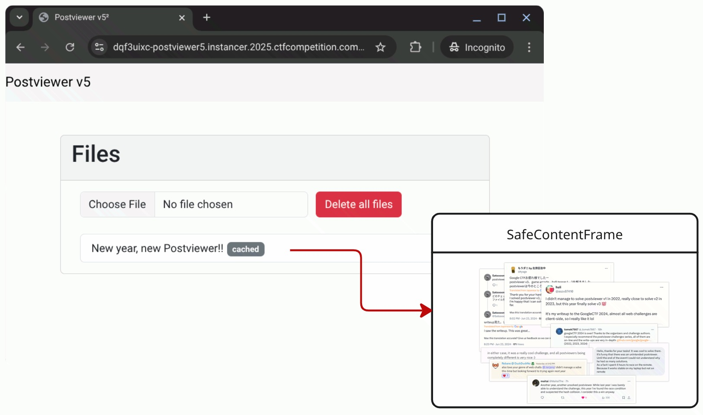
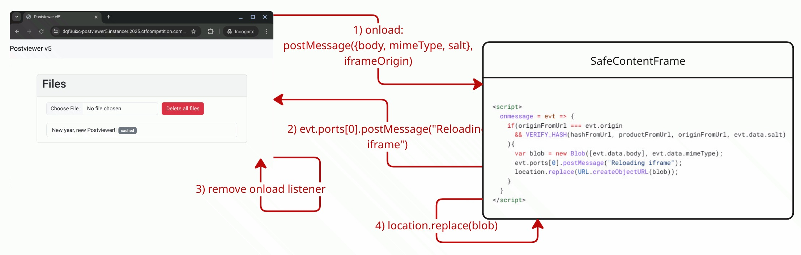

# Postviewer v5² Writeup by [@terjanq](https://twitter.com/terjanq)

**Google CTF 2025**

## Introduction

Postviewer challenges have become a highlight of the Web category of Google CTF, and this year featured yet another continuation of the series—Postviewer v5². There were two versions of the same challenge; the core challenge was for Chrome, and the other was for Firefox, called Postviewer v5² (FF).

This year, I intended the core challenge to be difficult, and this was indeed the case, given that only two teams managed to retrieve the flag: [justCatTheFish](https://ctftime.org/team/33893) and [Friendly Maltese Citizens](https://ctftime.org/team/220769).

I was very excited about this year's edition because it featured a production version of SafeContentFrame, a library for rendering active content that I have been developing at Google bascially since I joined. A blog post about it is coming soon!

The library is developed in a way to be difficult to misuse, and the challenge featured one of the ways this could happen with a tricky race condition.

It wasn't the SafeContentFrame's debut in Google CTF though. It was featured in the "Game Arcade" challenge in 2024 (you can read more about the challenge in the [writeup](https://gist.github.com/terjanq/27230afcee73ee75484ac14ac53e78bc#file-gamearcade-md))

## Application TL;DR

The frontend of the Postviewer was almost the same as in previous years: a simple page that lets users preview files stored in the browser's [IndexedDB](https://developer.mozilla.org/en-US/docs/Web/API/IndexedDB_API). Each file is rendered inside the aforementioned SafeContentFrame, as shown in the diagram.



Unlike in previous years, players could share their own files through a simple `postMessage`-based feature.

## SafeContentFrame TL;DR

The important aspects of how the key component (shim iframe) of the SafeContentFrame works are the following:

1.  The shim iframe is hosted on a secure origin in the form of `https://<hash>-h748636364.scf.usercontent.goog/google-ctf/shim.html?origin=https://postviewer5.com`.
2.  The `<hash>` is calculated as `sha256("google-ctf" + "$@#|" + salt + "$@#|" + "https://postviewer5.com");`, where `salt` is transmitted in the `postMessage`, its puprose is explained later.
3.  The shim iframe performs various integrity checks and can be simplified to the snippet below:


```html
<script>
  onmessage = evt => {
    if(originFromUrl === evt.origin
      && VERIFY_HASH(hashFromUrl, productFromUrl, originFromUrl, evt.data.salt)
    ){
      var blob = new Blob([evt.data.body], evt.data.mimeType);
      evt.ports[0].postMessage("Reloading iframe");
      location.replace(URL.createObjectURL(blob));
    }
  }
</script>
```

The threat model is that even if the secure origin is leaked to a malicious website, it won't be able to execute arbitrary JavaScript on that origin. This is because `originFromUrl` is part of the hash, and the shim only accepts messages from that origin.

The `salt` is used to isolate two different iframes from each other because otherwise, they would end up on the same origin, allowing a malicious document to steal other documents.

## Challenge Functionality

The challenge had a couple of different functionalities, which are briefly described in this section.

### Previewing Files

As in previous years, it was possible to display any file by adding `#<N>` to the URL.

### Cached Mode

The main functionality of the challenge was rendering files inside SafeContentFrame in two modes:

1.  **Cached mode:** The `salt`, mentioned in the previous section, is generated from the hash of the file's contents or its filename if the filename is longer than the hash.
2.  **Non-cached mode:** The `salt` is derived from `Math.random()`.

### Sharing Files

The application listened for `onmessage` events, making it possible to transfer a file from any origin and store in the indexedDB in the browser. The following features could be customized by the players:

1.  File's contents
2.  Filename
3.  Cached mode

### Admin Bot

Players can supply an arbitrary `https?://` URL, which causes an automated bot to perform the following steps:

1.  Visit the page URL on `http://localhost:1338`.
2.  Add a `non-cached` file with its content set to the plaintext flag.
3.  Visit the player's supplied URL.
4.  Close the browser after 5 minutes.

### One Iframe

Unlike in previous years, this challenge used only one iframe to render content. The content rendering process can be summarized as follows:

1.  Calculate the file's hash and construct a valid SafeContentFrame.
2.  Register an `onload` event.
3.  Upon receiving the `onload` event, send data to the SCF (this includes the file's contents, mime-type, and the aforementioned salt) and wait for the `Reloading iframe` response that signals a successful load of the file.
4.  Remove the `onload` event listener.

See the diagram:



## Solution

The solution consists of the following steps:

1.  Share a `non-cached` file with the admin that leaks `onmessage` events.
2.  Using a race condition, make the app leak the transmitted `salt` that is derived from `Math.random()`.
3.  From the leaked salt, recover five random numbers that were encoded as `base36`.
4.  Crack the pseudorandom number generator and predict future random numbers.
5.  Find a salt prediction where five concatenated random numbers are shorter than 51 characters.
6.  Share a `cached` XSS payload with the filename set to the predicted salt and with content such that its hash is shorter than the filename's length.
7.  From the XSS payload, transmit it to the calculated secure origin (e.g. `https://4petu6f8l4vwqn1261qrzwlv9vap3l9mqsuspa11cy50s3ovqy-h748636364.scf.usercontent.goog`) and store a reference to the iframe there (this was required because the iframe was hidden behind a [shadowRoot](https://developer.mozilla.org/en-US/docs/Web/API/ShadowRoot)).
8.  "Burn" random salts longer than 50 characters by making the app render a `non-cached` file before the prediction occurs.
9.  Make the app render the flag file wchich will be loaded on the origin derivied from the predicted salt, the same as our XSS payload.
10. From the transmitted XSS payload, access the iframe containing the flag and read its contents.

The most difficult, and also the core idea of the challenge, was winning the seemingly impossible race condition.

### Race Condition

The race condition to leak the salt is quite easy to win for `cached` files. Imagine the following file:

```html
<script>onmessage=e=>leak(e.data.salt)</script>
```

In cached mode, its secure origin will always be the same. Imagine sharing this file 100 times in rapid succession via the `postMessage` functionality.

```
1. share(file, cached=true)
2. share(file, cached=true)
...
99. share(file, cached=true)
100. share(file, cached=true)
```

The application will schedule 100 distinct `onload` events, and for each one, it will send `postMessage({body, mimeType, salt}, iframeOrigin)` to the shared iframe. The application only removes the `onload` event listener after receiving the `Reloading iframe` event. In theory, if we change the iframe's destination, the `Reloading` message will never arrive, and the salt will be indefinitely transferred to the iframe upon any iframe reload, making it trivial to leak. However, if I recall correctly, this didn't happen in practice, potentially due to how processes are allocated for same-origin iframes.

But we don't need this behavior to leak the salt. Notice that the application has already scheduled 100 onloads, and after the first successful load of the file, it will simply receive the `salt` for the `onload` events scheduled for the consecutive files.

But for `cached` files, the salt isn't derived from `Math.random`, so this race condition is quite useless (although it could be used to leak the flag without realizing how to bypass the `shadowRoot` limitation).

Let's modify the approach slightly and analyze what would happen in the following scenario:

```
1. share(file, cached=false)
2. // some timeout
3. iframe.location = "blob: onload=()=>window.history.back()"
```

What we want to achieve on the application side is the following:

1.  Register `onload` listener.
2.  The shim emits the 1st `onload` event.
3.  The app sends file and salt via `onload: postMessage({body: file, salt}, fileOrigin)`
4.  The iframe is redirected just before `Reloading iframe` is sent.
5.  A 2nd `onload` is scheduled, and the iframe goes back to the shim.
6.  The shim schedules `Reloading iframe` and loads the `file`.
7.  The 2nd scheduled `onload` event arrives.
8.  The app sends file and salt via `onload: postMessage({body: file, salt}, fileOrigin)`
9.  Because the file already rendered, it can read the transmitted salt.
10. The application receives `Reloading iframe` and removes the `onload` listener.

In the scenario above, we win the race if the scheduled `onload` event from the additional iframe load arrives before the shim sends `Reloading iframe`. This means the `salt` was transmitted a second time, allowing us to leak it.

In practice, however, the scheduled `Reloading iframe` message would arrive before the `file` had a chance to render and intercept the message. This makes perfect sense because the `file` is only rendered after the `Reloading iframe` message is sent. So how to win this "impossible" race?

The answer is slowing down the process! If we slowed down the main application's process then the file has a chance to fully render in step 6, before the `Reloading iframe` message is processed.

I left two intentional and one unintentional gadget for doing just that. See the comments below:

```javascript
window.onmessage = async function(e){
        // intentional, same as in Postviewer v1 players could
        // send a large chunk of data to cause the loose comparison to be slow
        if(e.data.type == 'share'){

          // intentional, gives the ability to execute an arbitrary number of
          // loop iterations, e.g. {file: {length: 1e8}}
          for(var i=0; i<e.data.files.length; i++){
            ...
          }
        }
        // unintentional, debug leftover which does essentially the same
        // as files.length gadget
        if(e.data.slow){
          for(i=e.data.slow;i--;);
        }
}
```

Slowing down a process is helpful in winning race conditions, thanks to process isolation. Even when the challenge application's main thread is blocked, cross-origin iframes can continue their calculations and event scheduling just fine. Let's once again review the events received by the challenge application:

1.  `onload` scheduled by the shim iframe
2.  `onload` scheduled by the additional blob iframe
3.  `Reloading iframe` scheduled by the shim iframe
4.  `onload` scheduled by the loaded file

What we need to achieve is for the salt-leaking `file` to be fully rendered before the `onload` scheduled by the additional blob iframe is received by the application. With some small timeouts, this could be achieved quite easily.

This race would be easier to win by embedding the challenge page inside an iframe because `iframe.location` could be directly invoked as in the example shown. However, the application was not frameable. In contrast to the embedding case, and it is only possible to change an iframe's location if it is same-origin with the window that initiates the redirection.

This constraint makes winning the race more difficult, but not impossible!

My approach for winning the race in the popup case was slightly different. Instead of redirecting the iframe, I shared a file that indefinitely redirects itself. The file can be simplified to:

```html
<script>
    setTimeout(()=>{
      location = URL.createObjectURL(new Blob([document.documentElement.innerHTML], {type: 'text/html'}))
    }, 150);
</script>
```

After the file above is shared, The following salt-leaking file is shared with the admin:

```html
<script>onmessage=e=>leak(e.data.salt)</script>
```

What needs to happen to win the race is:

1.  Share the redirect file with admin: `shareFile(redirectFile, cached=true)`
2.  Wait for the `redirectFile` to fully render.
3.  Share the salt leaking file with admin: `shareFile(saltFile, cached=false)`
4.  Slow down the challenge's process via a chosen gadget.
5.  The `onload` from the `redirectFile` is scheduled just before the `saltFile` is rendered.
6.  The `saltFile` gets fully rendered (which schedules `Reloading iframe`).
7.  The process becomes unblocked.
8.  The application receives the `onload` event and sends the `salt`.
9.  Quite instantly, the application recveives `Reloading iframe` message and removes the listener.

In principle, this looks reasonable and not too hard to implement. However, in practice, my exploit didn't work all the time, as I had tuned the timings suboptimally and taken the lazy path. I was pretty sure this could be coded better than my exploit, and the teams that solved the challenge proved this to be the case, leaking the salt very consistently.

You can read the full exploit in [exploit-chrome.html](./solution/exploit-chrome.html).

See exploit in action:


### Race Condition in Firefox

Winning the race in Firefox was easier. For some reason, if the challenge's process is slowed down, the `Reloading iframe` event is executed after the `onload` listener which means the only thing teams had to figure out was how to slow down the process.

This snippet won the race with almost 100% accuracy.

```javascript
    const buff = new Uint8Array(3e7);
    shareFile(blobSalt, 'blobsalt');
    // delay around 2.5s
    appWin.postMessage({ type: buff  }, '*', [buff.buffer])

    window.interval = setInterval(() => {
      const buff = new Uint8Array(2e7);
      appWin.postMessage({ type: buff  }, '*', [buff.buffer])
    }, 100);

    setTimeout(()=>{
      clearInterval(window.interval);
    }, 3_000)
```

You can read the full exploit in [exploit-firefox.html](./solution/exploit-firefox.html), but it's almost the same as the Chrome one, with the difference being in the above part.

### Predicting Math.random()

Predicting `Math.random()` was quite straightforward in Firefox, as one could simply use a publicly available [predictor](https://github.com/mkutay/spidermonkey-randomness-predictor/blob/main/main.py).

In Chrome, it was a bit trickier because Chromium recently [changed](https://source.chromium.org/chromium/_/chromium/v8/v8/+/e0609ce60acf83df5c6ecd8f1e02f771e9fc6538) how it generates random numbers, and all publicly available predictors needed to be patched by the players.

An additional issue was that finding a salt shorter than 51 characters required generating many random numbers. Generating 5,000 random numbers gave a prediction success rate of over 90%. Some publicly available predictors (for example, this [one](https://github.com/PwnFunction/v8-randomness-predictor)) can only correctly generate a couple of random numbers — to be precise, fewer than 64. This is because Chromium has a `RefillCache` of 64 random numbers, after which it needs to regenerate them.

While applying the patches for the Chromium change, I based my [predictor](./solution/crack-random.py) on the awesome research from [Kalmarunionen](https://ctftime.org/team/114856), which recovers the initial state and implements the predictor in a way that allows for generating any number of pseudorandom numbers. See the details of the research in the original [writeup](https://github.com/kalmarunionenctf/kalmarctf/tree/main/2025/web/spukhafte/solution).

## Closing Thoughts

Many players loved seeing another Postviewer challenge, but some also expressed disappointment, saying that the race condition part was quite painful and generally not fun. I feel that client-side race conditions are an under-researched topic and that even seemingly "impossible" races can be won. In my opinion, making the challenge artificially easier would not have made it a better challenge. Real-world exploitation does not compromise on the difficulty of finding the correct parameters that allow a race condition to be winnable.

This challenge featured a production version of SafeContentFrame, which is commonly used by Google products. It's designed to be difficult to misuse, and I was proud of finding a creative way of doing just that! :)
