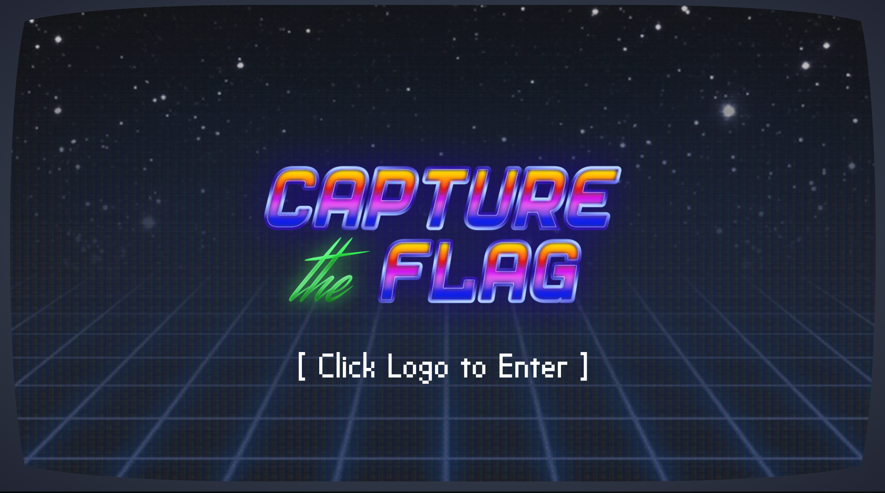

# Google CTF 2018 Scoreboard



During the Google CTF 2018 we built a custom scoreboard using Firebase. This is the code, the server-side code is `rules.json`, and the client side code is in the `frontend` directory.

To run this, you need to make the following changes:
 1. Create a Firebase project, see https://firebase.google.com/docs/web/setup for details.
 1. Set `rules.json` as the Firebase rules (that's the equivalent of the server-side code).
 1. Modify `frontend/vaporware.html` so that the script that includes bootstrap.js contains the following data attributes:
 ```html
     <script
        src="js/bootstrap.js" type="text/javascript"
        data-api-key="INSERT_YOUR_FIREBASE_API_KEY"
        data-auth-domain="INSERT_YOUR_FIREBASE_AUTH_DOMAIN"
        data-database-url="INSERT_YOUR_DATABASE_URL"
        data-project-id="INSERT_YOUR_PROJECT_ID"
        data-storage-bucket="INSERT_YOUR_BUCKET"></script>
 ```
 

# Notes
The scoreboard uses a third-party font called [VP Pixel Simplified](https://www.fonts.com/font/vp-type/vp-pixel/simplified), you can use instead [Free Pixel](https://www.dafont.com/free-pixel.font). This might require some changes to the CSS.

If you want to build upon this theme, feel free to, if you want to make changes to the graphics, the PSD files are available in the `psd` directory. We won't be making any changes to the design ourselves, but the author of the design is [Nicolas de Sola](https://www.behance.net/NicodeSola), so please direct any inquiries to him directly.
